Connect Google Chat when you want an agent reachable from Google Workspace, in direct messages with the app and in spaces it has been added to. Setup runs in two places: you create the app and its credentials in the Google Cloud console, and you paste Manyfold's inbound URL back into the Chat API configuration page.

## What the channel supports

| Capability | Support |
| ---------- | ------- |
| Direct messages | Yes; every message reaches the agent. |
| Spaces and group conversations | Yes; messages require an explicit @mention by default. |
| Mention detection | Yes; Chat marks its own mention natively, so no name matching is involved. |
| Threads | Yes; each thread gets its own session, and a reply nests under the message that started it. |
| Slash commands | Yes as typed text. Commands you configure in the Chat API console also work. |
| Live progress | Optional; Chat allows only one write per second in a space, so the default is to post the finished reply only. |
| Typing indicator | No; Chat exposes no typing API to apps. |
| Reaction acknowledgement | No; reacting to a message requires user authorization, which an app does not hold. |
| Incoming files | Yes, when uploaded to Chat directly. Google Drive attachments are skipped, because reading those needs a Drive scope the app does not hold. |
| Files in a normal Agent reply | No; uploading a file requires user authorization, so file links stay in the text. |
| Explicit Agent file send | No; `mf channels send --file` is not supported on Google Chat. |
| History backfill | No; reading past messages requires a scope that needs Workspace administrator approval. |

## Prerequisites

- An existing Manyfold agent.
- A Google Cloud project you can administer.
- Permission to install a Chat app in your Google Workspace domain.

## Set up Google Cloud

1. Open the [Google Cloud console](https://console.cloud.google.com/) and create a project, or select an existing one. Note its **project number** from the project picker; you may need it later.

   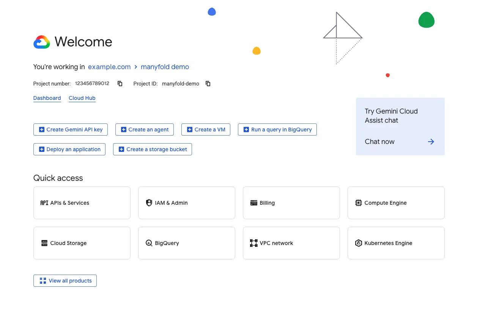

2. In the left-hand menu, open **APIs & Services → Library**, or type `Google Chat API` straight into the search box at the top.

   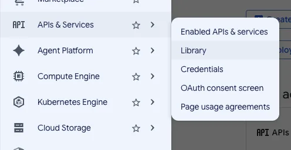

3. Pick **Google Chat API** out of the results, then enable it for that project.

   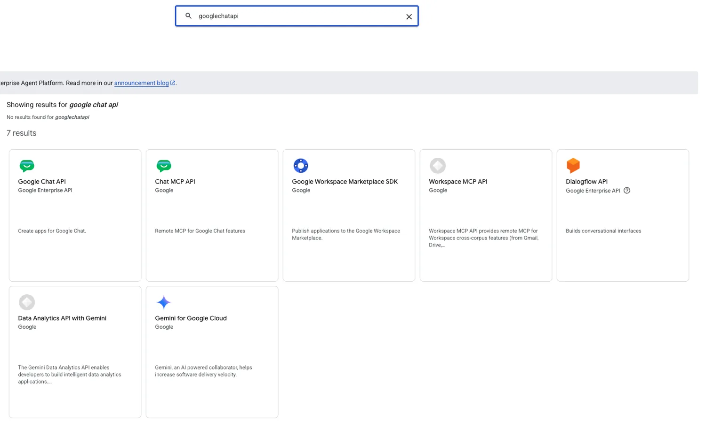

   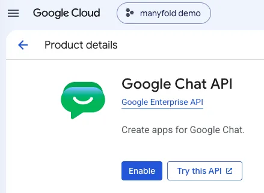

4. In the left-hand menu, go to **IAM & Admin → Service Accounts** and create a service account. It needs no project roles; the app's own identity is what matters.

   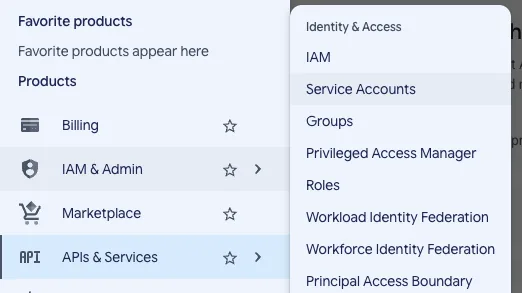

   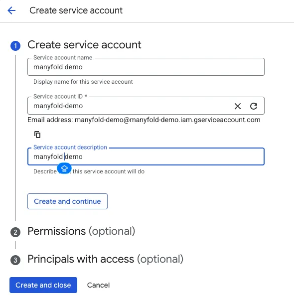

5. Open the new account's **Keys** tab, add a key, and choose **JSON**. The file downloads once, so treat it as a secret.

   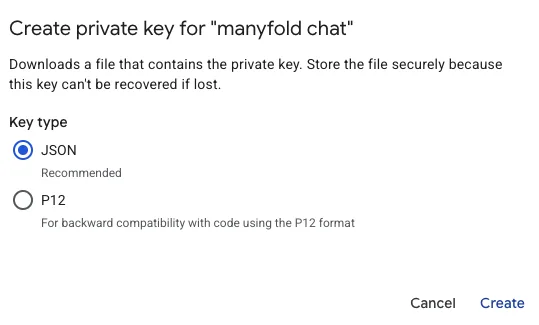

6. Go back to the Chat API page and open the **Configuration** tab. Before you fill in anything else, leave **Build this Chat app as a Workspace add-on** switched off. This is the setting that matters most on this page: turn it on and the app is deployed as an add-on instead, so Manyfold's HTTP endpoint is never called.

   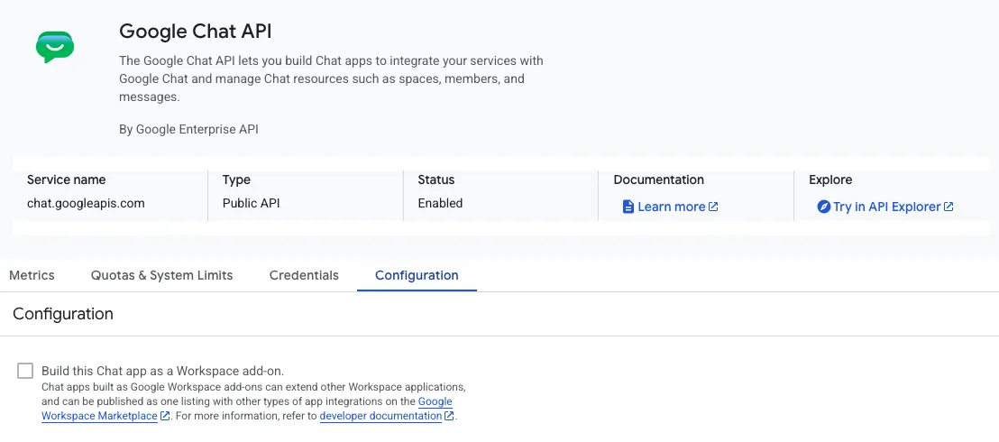

7. Fill in the app name, avatar URL, and description.

   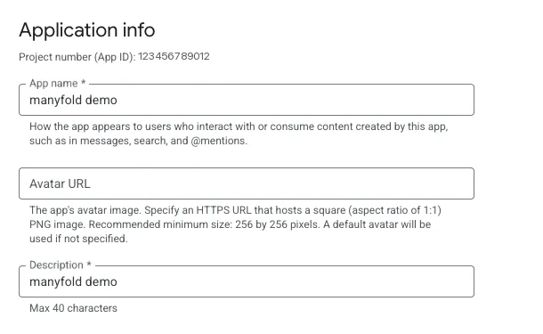

8. Under **Functionality**, enable **Join spaces and group conversations**. Direct messages need no setting of their own; the app receives them as soon as it exists.

   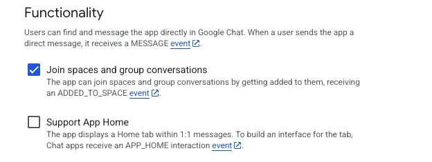

9. Under **Connection settings**, choose **HTTP endpoint URL**. Leave the URL blank for now; Manyfold gives it to you in the next section.

   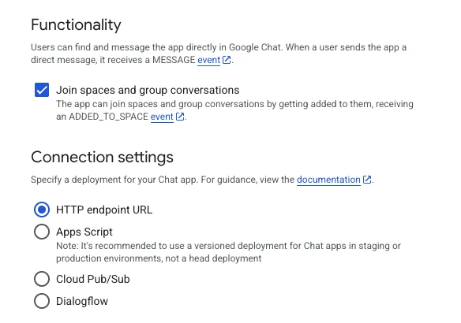

10. Under **Visibility**, make the app available to yourself or to your domain.

    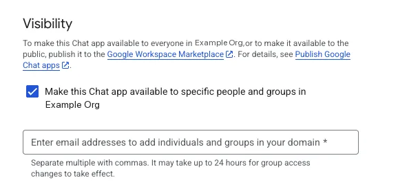

## Create the channel in Manyfold

1. Go to **Settings → Channels** and create a **Google Chat** channel.
2. Paste the contents of the downloaded service account JSON key file.

   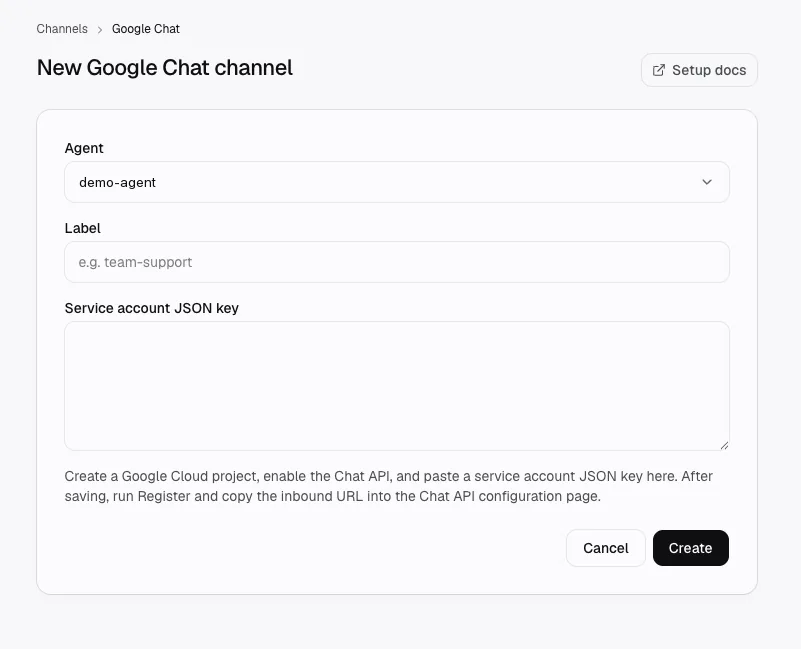

3. Save, then open the channel and run **Register**. This verifies the key, captures the authentication audience, and activates the channel.
4. Copy the channel's **inbound webhook URL**.

   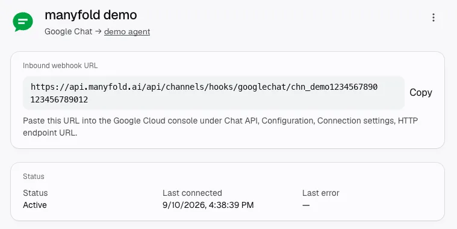

5. Back on the Chat API **Configuration** tab, paste it into **Connection settings → HTTP endpoint URL**, then click **Save**.

   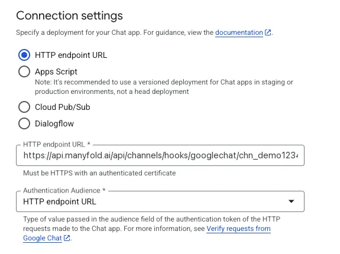

## Talk to the app

There are two ways to reach the app. Start with the direct message: it needs no space and no mention, so it isolates the channel from anything the space might be doing.

**Open a direct message.** Click **+** or **Start a chat** next to **Direct messages** in the Google Chat sidebar, search for your app's name, and pick the result labelled as an app rather than a space. Send `hi`. Every message in a direct message reaches the agent, so there is nothing to mention.

**Or add it to a space.** Click the space name at the top to open its menu, go to **Apps & integrations**, then use **Find apps** or the **+** in the Apps section. Search for your app and add it. Only then does it appear in the space's mention list, and `@your-app-name` reaches the agent.

Run **Test** on the channel, and incoming messages show up on the channel page straight away.

## Authentication audience

Google signs every request it sends you, and the **Authentication Audience** setting in the Chat API console decides what that signature claims. Manyfold has to be told the same thing, or every incoming message is rejected.

| Console setting | What Manyfold needs |
| --------------- | ------------------- |
| **HTTP endpoint URL** (default) | Nothing; Register fills it in from the inbound URL. |
| **Project Number** | Set the audience type to Project number and enter your Cloud project number. |

If you change this setting in the console later, change it on the channel too. A mismatch shows up as every message being ignored, with rejected deliveries on the channel page.

## Replies and the per-space write limit

Google Chat allows **one write per second in each space**, and that budget is shared with every other Chat app in the same space. Editing a message counts against it just like posting one.

Because of that, this channel defaults its reply mode to **Final**: the agent posts once, when it is done. Live progress is available (set the reply mode to **Preview** and the agent edits a placeholder as it works), but it spends the space's write budget, so it suits direct messages and quiet spaces rather than busy ones.

Long replies are split across several messages, paced about a second apart, and kept in the same thread.

## Threads

Google Chat opens a thread for every new top-level message in a space, whether or not anyone replies in it. Manyfold treats that as follows:

- In a **space**, when the agent is going to answer, it replies inside the thread Chat created, so the question and answer stay together. Each thread is a separate session. Turn off **Reply in the message thread** if your space is configured for unthreaded messages.
- In a **direct message**, replies stay at the top level. A DM only gets a separate session if you deliberately open a thread.

## Access control

Leave **Allowed space IDs** and **Allowed user IDs** empty to let anyone who can reach the app use it. Users can be listed by email address or by their `users/{id}` resource name.

**Operator user IDs** control who may run agent-wide commands such as `/model`. With no operators listed, those commands are disabled from Google Chat.

## Troubleshooting

**Every message is ignored, and the channel shows rejected deliveries.** The authentication audience does not match. Check the Chat API console's **Authentication Audience** against the channel's audience setting, and confirm the inbound URL in the console is exactly the one on the channel page.

**Nothing arrives at all.** Confirm the app's **Connection settings** point at the channel inbound URL, that the app status allows your account to use it, and that the app has been added to the space.

**Replies fail with a permission error.** The app has been removed from the space, or the service account key has been revoked. Run **Test** on the channel to see which.

**The agent answers in the space instead of in a thread.** The space is configured for unthreaded messages. Turn off **Reply in the message thread**.
