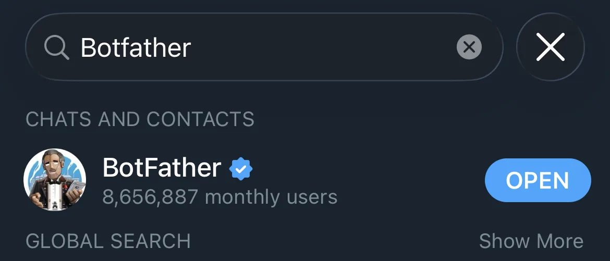
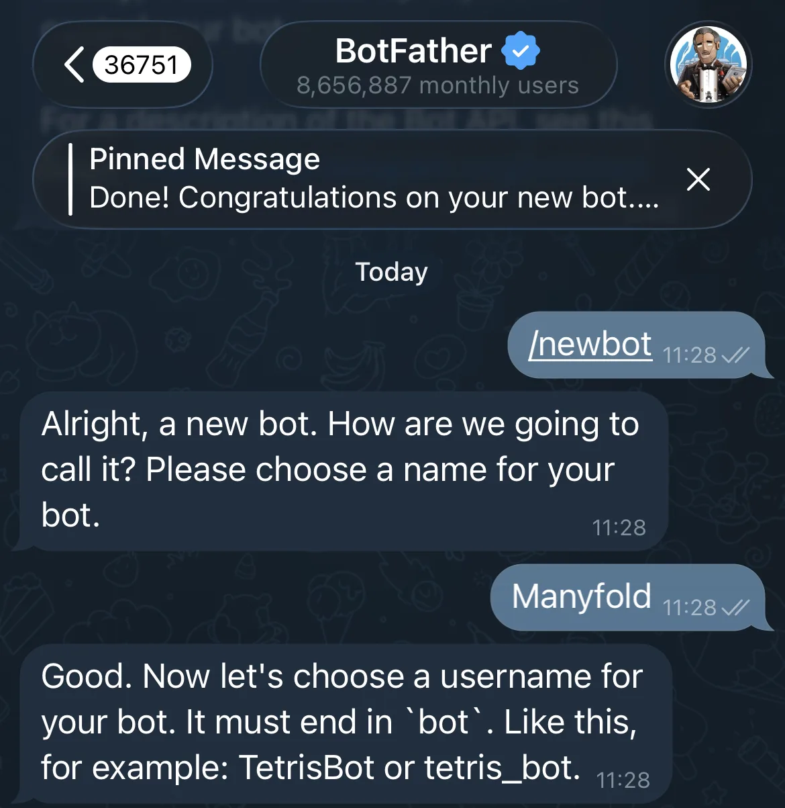
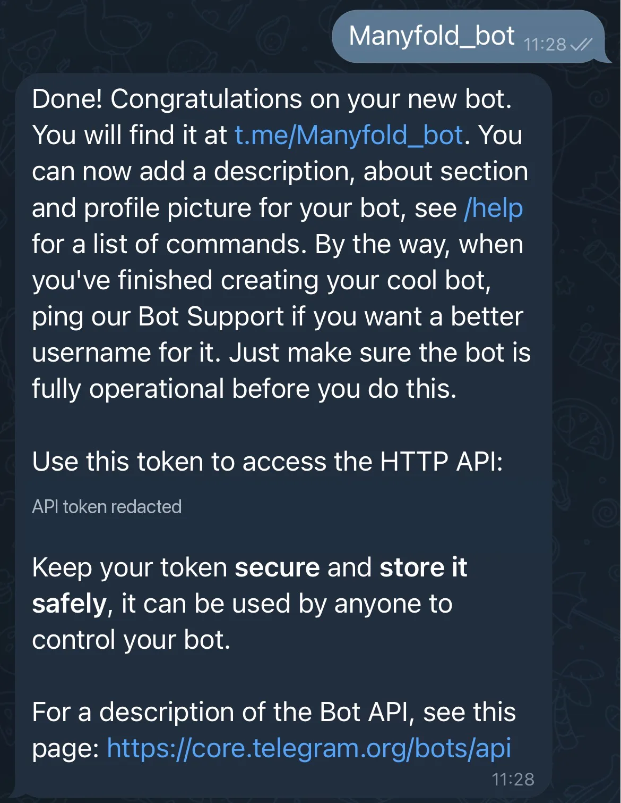
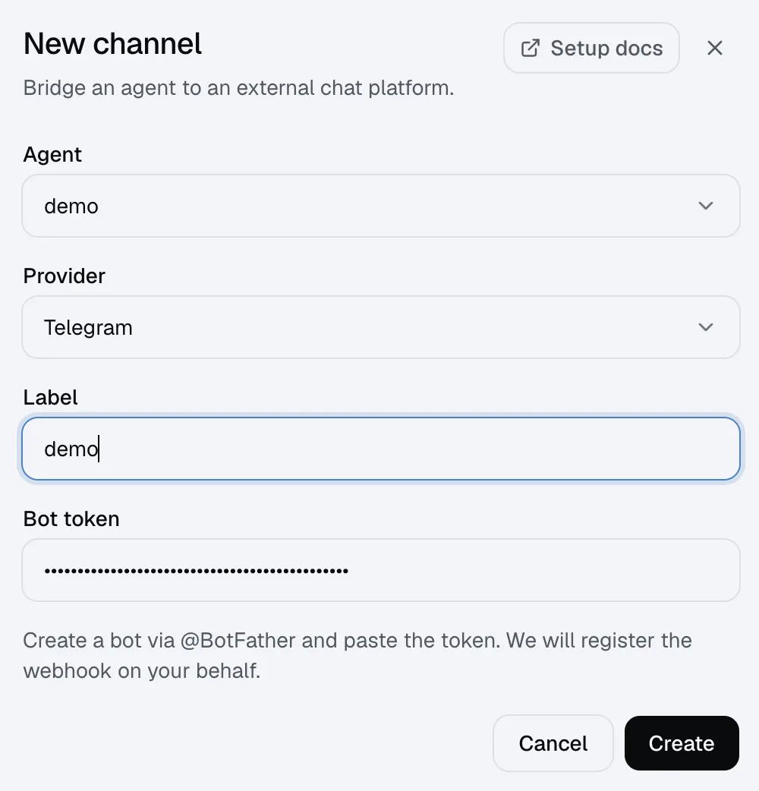
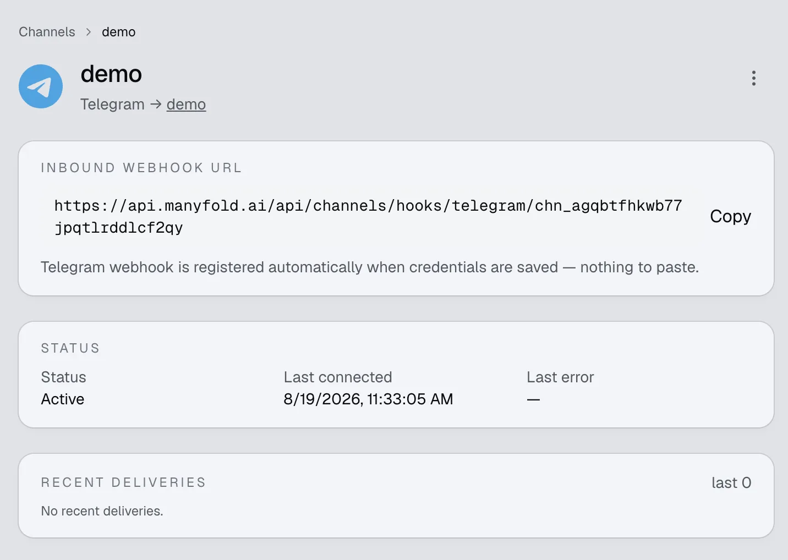
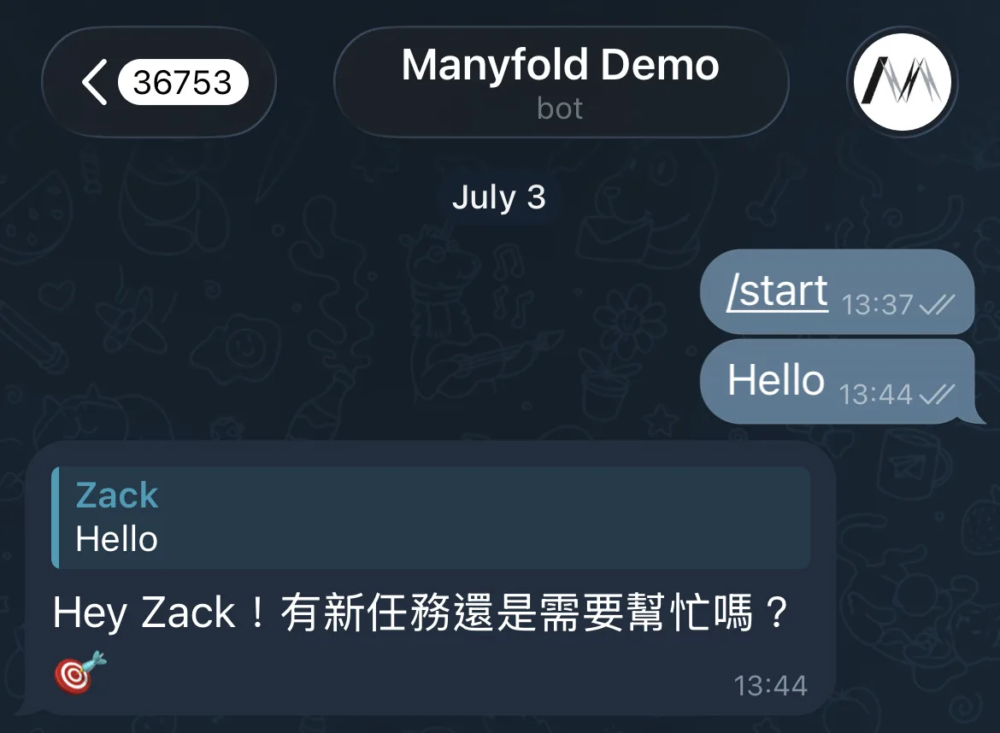

Connect Telegram when you want an agent available in direct messages, groups, supergroups, or forum topics. Manyfold manages the bot webhook and command menu for you.

## What the channel supports

| Capability | Support |
| ---------- | ------- |
| Direct messages | Yes; every accepted text message or caption is directed to the agent. |
| Groups and supergroups | Yes; ordinary messages require an explicit @mention by default. |
| Forum topics and message replies | Yes; thread isolation scopes forum topics by topic ID and ordinary replies by the directly referenced message. |
| Slash commands | Yes; Manyfold attempts to register the command menu, and typed commands work even if menu registration fails. |
| Live progress | Yes; the bot edits one preview message while the agent works. |
| Incoming files and media | No; only text messages and text captions are currently passed to the agent. |
| Files in a normal Agent reply | No; file links remain in the text reply. |
| Explicit Agent file send | Yes; `mf channels send --file` uploads workspace files. |
| Broadcast channels | No; `channel_post` updates are not registered or processed. |

## Prerequisites

- An existing Manyfold agent.
- A Telegram bot token from `@BotFather`.
- Permission to add the bot to a group if you want group access.

## Create the bot

1. Open Telegram and start a chat with `@BotFather`.

   

2. Send `/newbot` and follow the prompts.

   

3. Choose a display name and a globally unique username ending in `bot`.
4. Copy the bot token. Treat it like a password.

   

5. If the bot should receive ordinary group messages without an @mention, open **Bot Settings -> Group Privacy** in BotFather and disable privacy mode. Re-add the bot to an existing group if Telegram does not apply the change there.

BotFather also has optional commands for how the bot presents itself: `/setdescription` for the long description, `/setabouttext` for the short bio, `/setuserpic` for the avatar, and `/setcommands` to populate Telegram's own command menu.

Keep privacy mode enabled when **Mention only** is on. Telegram will still deliver commands, direct replies to the bot, and messages that mention it, while hiding unrelated group traffic. A delivered reply is not automatically a Manyfold mention: ordinary reply text must still include `@BotUsername`, unless **Mention only** is off.

## Connect it to Manyfold

1. Open **Settings -> Channels**.
2. Create a channel and choose **Telegram**.
3. Select the agent that should receive messages.
4. Enter a label and paste the bot token.

   

5. Create the channel.
6. Open the channel detail page and run **Test**.

   

Manyfold automatically:

- generates a webhook secret;
- registers the channel's inbound URL with Telegram and verifies every request with Telegram's secret-token header;
- limits webhook updates to messages and edited messages, and discards updates that were already pending when registration ran;
- attempts to register all supported slash commands in Telegram's command menu. A menu-registration failure is returned as a warning and does not disable chat or typed commands.

Updating the token or running channel registration again refreshes the webhook and command menu. You do not need to copy the inbound URL into BotFather.

## Conversation behavior

- Direct messages have a separate session for each Telegram user.
- In groups, sessions are separated per user unless **Share session in channel** is enabled.
- With **Thread isolation** on, a forum topic uses its stable Telegram topic ID. Outside a forum topic, a reply is scoped to the message it directly references and the bot replies to that message; do not rely on an arbitrary multi-level reply chain sharing one session.
- Recognized slash commands run without an @mention, including Telegram's `/list@YourBot` form.
- Telegram has no sender allowlist or operator-user setting. Anyone who can reach the bot can run recognized commands, including agent-wide commands such as `/model`; restrict bot and group access accordingly.
- Edited text messages are accepted as new inbound events. Media-only messages are ignored; a media caption is handled as text but the media itself is not attached. In a mention-only group, the caption must explicitly mention the bot.
- Replies longer than 4,000 characters are split into messages. Code fences stay balanced across chunks, and Markdown tables are wrapped as text so Telegram does not collapse their layout.
- Preview mode sends `thinking…`, edits that message while the agent works, and falls back to a fresh message if the final edit fails.

See [Session switching](/docs/channels/session-switching/) for `/new`, `/list`, `/switch`, `/stop`, `/model`, `/usage`, and the other channel commands.

## Send proactively from the Agent

An Agent can use `mf channels send` to start a Telegram DM, post into a group or topic chat ID, reply to a known Telegram message, and explicitly upload up to four workspace files. This does not change inbound media support or the normal-reply file-link behavior above. See [Send from an agent](/docs/channels/agent-send/) for target IDs, examples, delivery results, retries, and limits.

## Settings

| Setting | Recommendation |
| ------- | -------------- |
| Mention only | Keep on for groups. Turn it off only after disabling Telegram Group Privacy. DMs are unaffected. |
| Shared session | Keep off for per-user context; turn on only when everyone in a group should share one conversation. |
| Thread isolation | Keep on for forum topics and reply-heavy groups. |
| Progress mode | **Preview** edits one live message; **Activity** also includes tool/thinking activity; **Final** sends only the completed answer. |
| Send message context | Keep on so the agent receives sender, chat, thread, and message IDs with each turn. |
| `resetOnIdleMins` (API) | Set a minute threshold to start a fresh session after inactivity; leave unset or `0` to disable. |

## Verify

Run **Test** on the channel detail page. A healthy result confirms the bot identity, verifies that Telegram points to this channel's webhook, and reports pending updates. A delivery error from the last five minutes fails the test; an older Telegram error is shown as stale information until a successful delivery clears it. Test does not verify that the optional command menu was registered.

Then test both paths you intend to use:

1. Send a direct text message to the bot.
2. For group use, add the bot and send `@BotUsername hello`.
3. Run `/help` to confirm the command menu and command handler.

## Troubleshooting

- **Token test fails**: revoke or regenerate the token in BotFather, update the channel, and register it again.
- **Webhook URL does not match**: run the channel's registration action again. Another service using the same bot token may have replaced the webhook.
- **Direct messages work but ordinary group messages never arrive**: mention the bot, or disable Group Privacy in BotFather and re-add the bot. Telegram may deliver direct replies to the bot, but a reply alone does not pass Manyfold's mention gate.
- **Group messages arrive but are ignored**: mention the exact bot username, including in media captions and replies, or turn off **Mention only**.
- **The bot replies in the wrong conversation**: enable **Thread isolation** for forum topics or direct message replies; check **Share session in channel** for group-wide context.
- **The command menu is missing**: typed commands still work. Run registration again and inspect its result for a `setMyCommands` warning.
- **Older messages disappeared after registration**: registration intentionally drops Telegram updates that were already pending so stale messages do not start agent turns.
- **A user can run `/model` unexpectedly**: Telegram has no operator list. Limit who can message the bot or join its groups.
- **A photo or file is ignored**: Telegram media is not currently downloaded by this channel. Send the relevant content as text or use Slack, Lark/Feishu, or Discord for file input.
- **A broadcast-channel post is ignored**: Telegram `channel_post` updates are outside this provider's supported IM scope.

## See also

- [Connect channels](/docs/channels/)
- [Session switching](/docs/channels/session-switching/)
- [Slack](/docs/channels/slack/)
- [Lark and Feishu](/docs/channels/lark/)
- [Discord](/docs/channels/discord/)
- [Matrix](/docs/channels/matrix/)
- [Send from an agent](/docs/channels/agent-send/)
- [Telegram Bot API](https://core.telegram.org/bots/api)
- [Telegram bot privacy mode](https://core.telegram.org/bots/features#privacy-mode)
