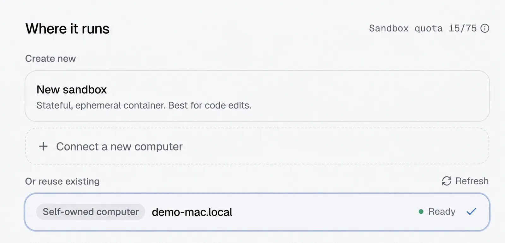

**Quick rule:** Choose **Stateful sandbox** when you do not need your own machine. Choose **Self-owned computer** when work needs your repository, CLI, GPU, or private network. Choose **Cloud computer** for always-on services and scheduled work.

Either runtime needs a Manyfold account; a self-owned computer also needs an online Mac, Linux, or Windows machine.

## What is a Stateful sandbox?

A Stateful sandbox is a Manyfold-provided **isolated cloud workspace**. It can pause and resume while keeping the agent's files and session state — including any coding-CLI sign-in you complete in its terminal, so an agent created with **Use your own subscription** stays signed in until the sandbox is deleted. Manyfold recommends that most users start with this runtime because it does not require you to configure your own computer or local daemon.

## What is a self-owned computer?

A self-owned computer is a Mac, Linux, or Windows machine you control. The Manyfold `mf` CLI runs a local daemon there and routes agent work to it. The agent can therefore use the local workspace you choose, installed CLI tools, GPU, and network environment.

## Sandbox vs. self-owned computer: full comparison

| Area | Stateful sandbox | Self-owned computer |
| --- | --- | --- |
| **Where it runs** | Manyfold's isolated cloud workspace | A Mac, Linux, or Windows computer you control |
| **Setup** | Select it when creating the agent; best for getting started quickly | Install and sign in to the `mf` CLI, register the local daemon, then select the machine |
| **File access** | Uses the cloud agent workspace | Can use the local workspace, repository, and filesystem you choose |
| **Tools and environment** | Uses the sandbox environment | Can use installed CLI tools, packages, and local sign-in state |
| **GPU, VPN, and private network** | Does not use your local hardware or private network | Can use your own GPU, VPN, private network, and compute environment |
| **Availability** | Can pause and resume while keeping its state | Your computer must be powered on, online, and running the `mf` daemon |

## How do you choose the right runtime?

| If the task | Choose |
| --- | --- |
| does not need your computer or internal network | **Stateful sandbox** |
| must change a local project, or needs your CLI, GPU, VPN, or private network | **Self-owned computer** |
| needs an always-on cloud service, connector, or schedule | **Cloud computer** |

### Typical reasons to choose a sandbox

- You are trying an agent for the first time and want to start a coding or research task quickly.
- The project and material can live in the cloud agent workspace.
- The work does not require a local repository, a specialized CLI, a GPU, company VPN access, or a private network.
- You want an isolated environment and the ability to resume the same session later.

### Typical reasons to choose a self-owned computer

- The agent must work on a project already under development on your computer.
- The task depends on locally installed or signed-in Codex, Claude Code, Gemini CLI, a database, SDK, or another tool.
- The task needs your GPU, a company VPN, internal services, or local network resources.
- You want the agent to work in a specific local folder while keeping the work visible and manageable in Manyfold.

*Choose a self-owned computer or a new sandbox from Where it runs while creating an agent.*

**Need to connect your own computer?** Read [Run AI agents on your own computer](/docs/run-agents-on-your-computer/) for macOS, Linux, Windows, the mf CLI, Workspace, and model source.

## Do not confuse a cloud computer with a sandbox

Cloud computer is a third runtime. Manyfold documents it for agents that need an **always-on process, connector, service, or scheduled workflow**. It is a long-running computer in Manyfold's cloud; it is not the same as a Stateful sandbox, and it does not depend on your laptop remaining powered on.

## Frequently asked questions

- **Do sandboxes have a terminal and files?**

  Yes. Each agent has its own chat sessions, files, terminal access, skills, and settings. The difference is whether that workspace runs in a cloud sandbox or on your own computer.
- **What happens to my local agent if my computer is off?**

  An agent assigned to a self-owned computer cannot receive new local work until the computer is back on, connected, and its `mf` daemon is running.
- **Can I use more than one runtime?**

  Yes. Different agents can use different runtimes. For example, use Stateful sandbox for general work and a self-owned computer for an agent that needs your local project.

## See also

- [Create your first agent: choose framework and runtime](/docs/create-agent/)
- [Register a self-owned computer: local daemon and your own machine](/docs/local-daemons/)
- [mf CLI guide](/docs/cli/)
- [Getting started with Manyfold](/docs/getting-started/)
- [Use the workspace: agent chat, files, and terminal](/docs/workspace/)
