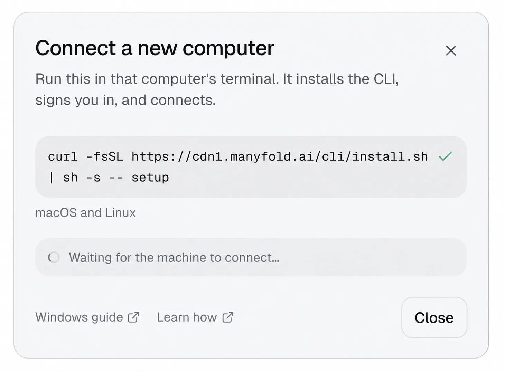
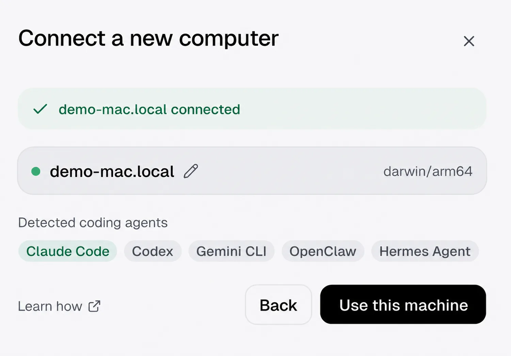
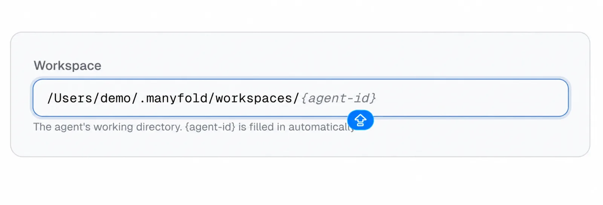
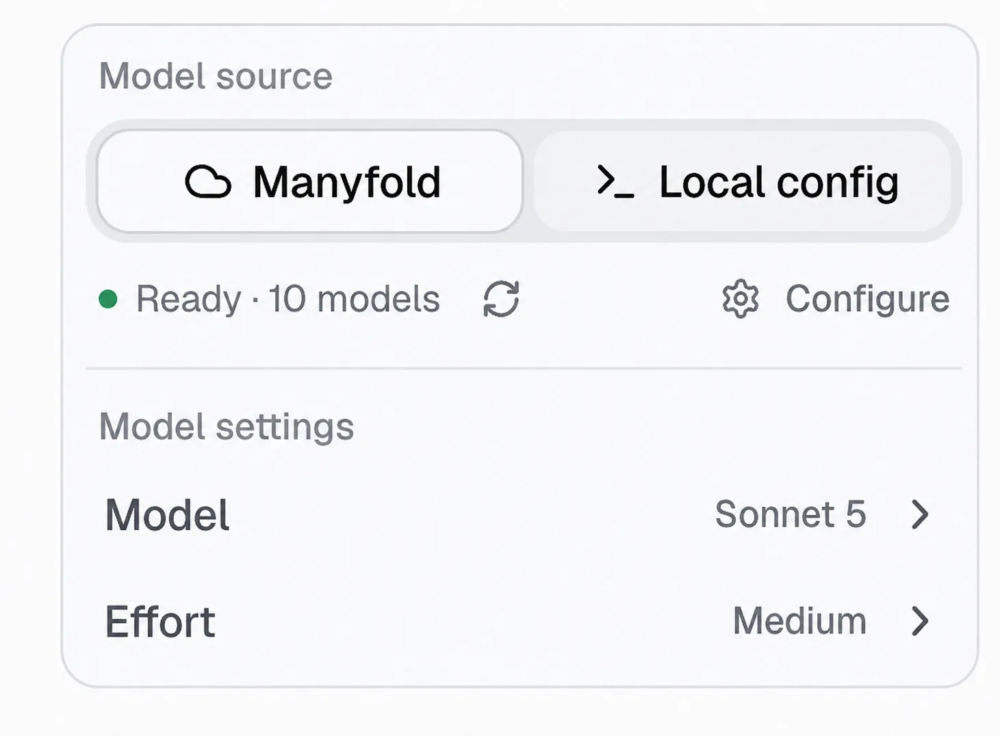
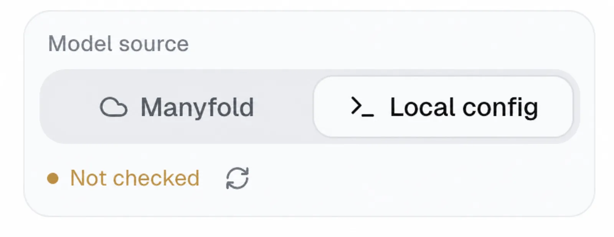

**Quick answer:** In **Create agent → Advanced → Where it runs**, choose **Connect a new computer**. Run `mf setup` on that computer, then return to the creation flow and select the connected machine.

## Before you begin

- **Manyfold access**: You need to sign in to Manyfold and have permission to create an agent.
- **Target computer**: Prepare the Mac, Linux, or Windows computer that will run the agent and make sure it can connect to the internet.
- **Directory and tools**: Choose the directory the agent should access and install the coding-agent CLI you plan to use.

If you are unsure whether to use a sandbox or your own computer, read the [sandbox vs. self-owned computer comparison](/docs/choose-a-runtime/) first.

## When should you use a self-owned computer?

A self-owned computer routes agent work to a machine you control rather than to a cloud sandbox. Once installed, the `mf` CLI keeps a local daemon connected, advertises available coding agents, and handles agent sessions when work is assigned.

Choose your own computer when an agent needs direct access to local repositories or files, existing CLI tools and sign-ins, a GPU, a VPN, a private network, or a specific development environment. Manyfold remains the team control plane; the selected computer performs the actual workspace and tool operations.

## Step 1: Connect a new computer while creating an agent

1. Choose **Create agent** in Manyfold.
2. Open **Advanced** and scroll to **Where it runs**.
3. Choose **Connect a new computer**.


*Connect a new self-owned computer from the agent creation flow.*



*The connection dialog provides the macOS/Linux command and a Windows guide.*

## Step 2: Install and connect Manyfold on the target machine

Open a terminal on the **same computer that will run the agent**, then follow the instructions for its operating system.

- **macOS**: Open Terminal from Applications → Utilities, or search for Terminal with Spotlight.
- **Linux**: Open your system terminal.
- **Windows**: Choose Windows guide in the connection dialog and use PowerShell or Command Prompt.

### macOS and Linux

Paste and run:

```sh
curl -fsSL https://manyfold.ai/cli/install.sh | sh -s -- setup
```

### Windows

1. Choose **Windows guide** in the connection dialog.
2. Download the Windows `mf.exe` binary, extract it into a stable folder, and add that folder to your Windows `PATH`.
3. Open PowerShell or Command Prompt and run:

```sh
mf setup
```

Follow the browser sign-in and authorization flow. Windows does not automatically install a Manyfold background service. After setup, run the daemon in the foreground and keep that terminal open:

```sh
mf daemon start --foreground
```

To keep the daemon available after a restart, configure Windows Task Scheduler or your preferred service manager to run that command at sign-in.

## Step 3: Sign in and confirm that the machine is connected

The installer opens a browser for you to sign in and authorize Manyfold. When it completes, `mf` registers the machine, detects installed coding agents, and starts the local daemon. Return to Manyfold; when the machine has a green state and says **connected**, choose **Use this machine**.



*A green state means the machine is ready to be selected as an agent runtime.*

> **Security note:** Do not publish sign-in URLs, authorization codes, machine tokens, API keys, or terminal screenshots that contain them.

## Step 4: Choose the computer, workspace, and model source

In **Where it runs**, choose the connected self-owned computer with the **Ready** status. Then configure the agent's **Workspace**, the local working directory that the agent can use.

- For a new agent, keep the default: `~/.manyfold/workspaces/{agent-id}`.
- For an existing project, enter its absolute path, such as `/Users/your-name/Projects/my-app`.
- Make sure the signed-in computer user has read and write access to that directory.



*Choose a local working directory that is appropriate for the agent and its permissions.*

### Choose a model source

| Model source | Best for |
| ------------ | -------- |
| **Manyfold** | Models configured, managed, or provided by your Manyfold workspace. Use this for centralized provider, usage, and cost management. |
| **Local config** | Credentials already available to the selected coding agent on this computer, such as a CLI sign-in session, subscription, or framework-specific API key. |



*The Manyfold source is useful for centrally managed team access.*



*Local config uses available credentials for the selected local framework.*

If Local config says **Not checked**, refresh its status and make sure the relevant Claude Code, Codex, or Gemini CLI is installed and signed in on this computer. To use a team or personal API key, add, test, and save a provider in [Model providers](/docs/model-providers/).

## Step 5: Create the agent and verify daemon health

Finish the remaining agent settings and create the agent. It will now work in the selected local workspace while remaining visible and manageable in the Manyfold team workspace.

```sh
mf daemon status
mf daemon logs
mf daemon doctor
```

On macOS and Linux, `mf setup` installs a user-scope autostart unit, so you generally do not need to keep Terminal open. On Windows, `--foreground` requires the process to stay running. An agent cannot receive new local work when the machine is powered off, asleep, or its daemon is stopped.

**Not sure whether to use a sandbox or your own computer?** Compare the two runtimes in [Sandbox vs. self-owned computer](/docs/choose-a-runtime/).

## Frequently asked questions

- **What is the difference between a self-owned computer and a sandbox?**

  A sandbox runs in Manyfold's isolated cloud environment. A self-owned computer runs on a machine you control, so it can use local files, tools, and network access. Both can be used to create and manage Manyfold agents.
- **Can I use my own Codex or Claude Code subscription?**

  Yes. With Local config, Manyfold uses credentials that the selected local framework can access. Make sure its CLI is installed, working, and signed in. Subscription and API-key support can differ by framework. Sandboxes and cloud computers support this too: choose **Use your own subscription** when creating the agent, then sign in from its built-in terminal.
- **Does my computer need to stay on?**

  Yes. Whenever an agent needs to run on this computer, it must be powered on, online, and running the `mf` daemon.
- **Can I connect more than one computer?**

  Yes. Each connected computer appears in the Where it runs list. Choose the machine that should run each agent.

## See also

- [Register a self-owned computer: daemon, autostart, and troubleshooting](/docs/local-daemons/)
- [Install the Manyfold CLI](/docs/install/)
- [Learn the mf CLI](/docs/cli/)
- [Create your first agent](/docs/create-agent/)
- [Configure model providers](/docs/model-providers/)
- [Use the agent workspace](/docs/workspace/)
