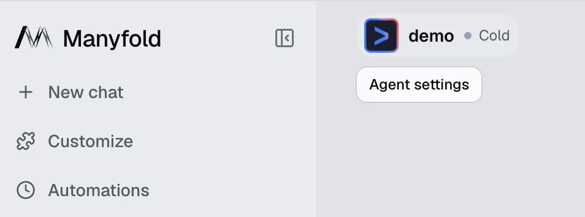
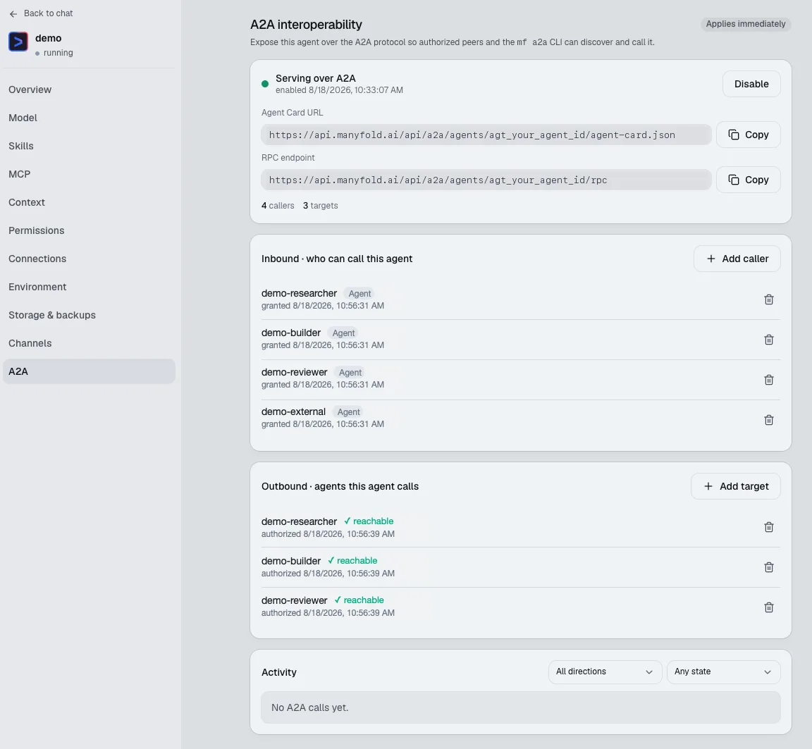
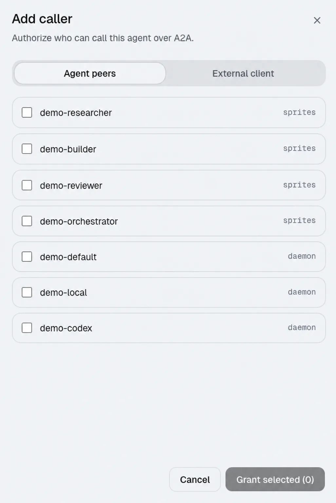
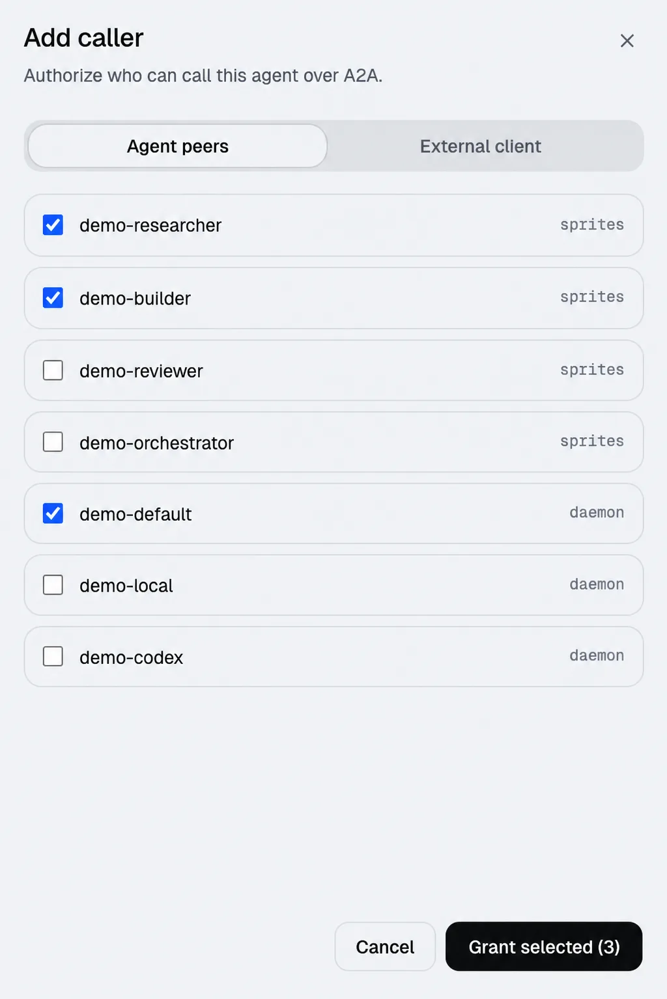
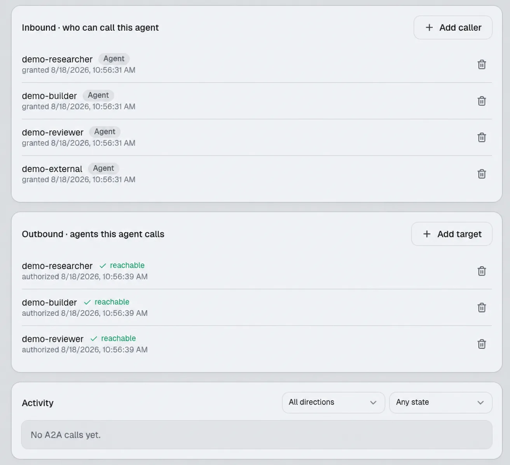

**打开 Agent settings → A2A，开启 exposure，授予所需 caller 或 target，然后确认绿色 reachable 状态**。Inbound 回答「谁可以调用这个 Agent？」；Outbound 回答「这个 Agent 可以调用谁？」

只配置工作流需要的路径。权限是有方向的，不会自动开放给 workspace 中的所有 Agent。

## 1. 打开 Agent settings

在主 workspace 中点击 Agent 信息，或打开 Agent 名称旁的三点菜单，然后选择 **Agent settings**。



*从 Agent 信息区域打开 Agent settings。*

## 2. 开启 A2A 并理解两个方向

在设置侧边栏底部选择 **A2A**，然后开启 exposure。页面会显示 Agent Card、RPC endpoint、Inbound callers、Outbound targets 和 Activity。



*A2A 设置页是管理 Agent 授权调用路径的控制面板。*

- **Inbound，谁可以调用这个 Agent**：授权 Manyfold Agent 或 External client 调用当前 Agent。当前 Agent 是被调用方。
- **Outbound，这个 Agent 可以调用谁**：授权当前 Agent 调用指定的目标 Agent。当前 Agent 是调用方。

有效路径是 **调用方 Outbound → 目标 Inbound**。两边都同意后，调用才会成功。

## 3. 授权 Agent peers 或 External clients

点击 **Add caller** 配置 inbound，点击 **Add target** 配置 outbound。Agent peers 是 Manyfold workspace 中已有的 Agent；External client 用于让外部服务通过 A2A API 凭据连接。



*选择允许调用当前 Agent 的 peer。*



*授权前再次确认选择内容。*

点击 **Grant selected**。授权身份会出现在对应的 Inbound 或 Outbound dashboard。



*绿色 reachable 状态表示 outbound 路径可以被发现。*

> **安全提醒**：Agent Card URL、RPC endpoint、External client 凭据和 API token 都应视为密钥。

## 4. 回到 workspace 委派任务

选择 caller Agent 并发送范围明确的任务，写清目标、范围、交付物和停止条件。

```text
委派给 demo-researcher：
目标：梳理 authentication flow。
范围：只读检查 src/auth 和相关 tests；不要修改或 commit。
交付：文件清单、三个风险、最小修正建议。
停止条件：返回 brief 后停止。
```

如果要了解更完整的协作模式，请阅读[设计 Multi-Agent 工作流](/zh/docs/a2a/workflows/)。

## 常见问题

- **开启 A2A 后所有 Agent 都能调用吗？**

  不会。Exposure 和 caller grant 是独立控制，只授权工作流确实需要的 Agent 或 client。
- **为什么 Outbound target 显示不可达？**

  确认目标 Agent 已开启 exposure，并且目标的 Inbound section 已授权当前 caller，然后刷新 A2A 状态。

**想了解工作流设计**？阅读[Multi-Agent A2A 工作流指南](/zh/docs/a2a/workflows/)。

## 另请参阅

- [Manyfold A2A API 文档](/zh/docs/api-a2a/)
- [mf CLI 指南](/zh/docs/cli/)
