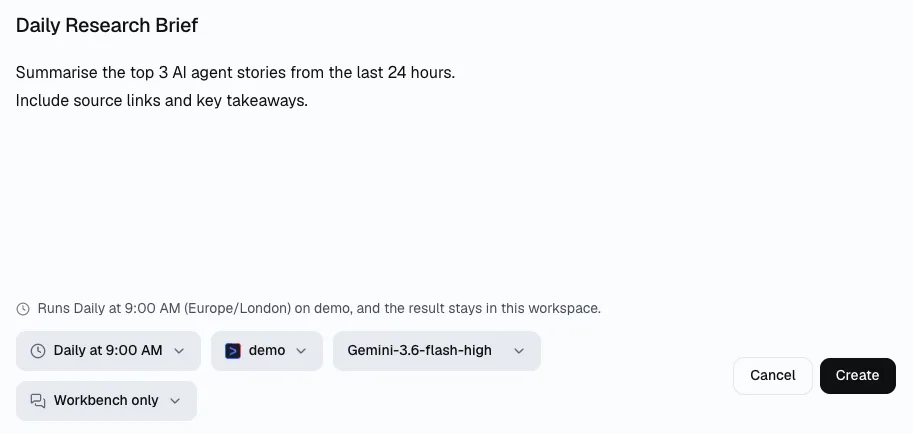
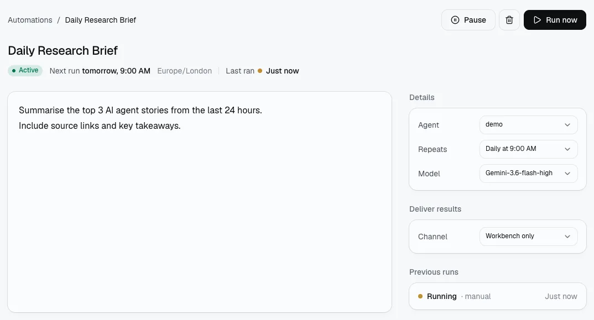
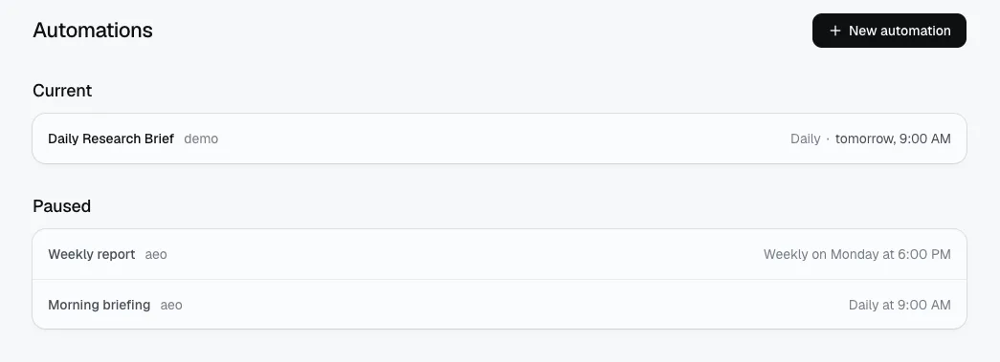

**点击侧栏的「自动化」→「新建自动化」，填写标题、prompt、运行时间、Agent 和模型，然后点击「创建」。**

创建后，你可以在详情页修改重复时间、模型和结果交付渠道，也可以暂停任务或点击「立即运行」立即执行一次。

## 第 1 步：打开「自动化」页面

先在 Manyfold 左侧侧栏点击 **自动化**（Automations）。进入页面后，点击右上角的 **新建自动化**（New automation）。

## 第 2 步：填写 Automation 设置

在创建面板中，把一个可重复执行的任务拆成五项：

- **Automation title**：用一句话说明任务，例如 *Daily Research Brief*。
- **Prompt**：写清 Agent 要做什么、输出什么，以及必要的范围或格式。
- **运行时间**：选择每天、每周或其他可用的执行计划。
- **Agent**：选择负责执行这个任务的 Agent。本文使用 demo 作为示范。
- **模型**：选择这个 Automation 使用的模型，例如 Gemini-3.6-flash-high。



*创建时一次设置标题、prompt、计划、Agent 和模型。*

一个好的 prompt 应该能在没有额外追问的情况下完成任务。例如：

```text
Summarize the top 3 AI agent stories from the last 24 hours.
Include source links and key takeaways.
Return the result as a short Markdown brief.
```

确认内容后点击 **创建**。

## 第 3 步：创建后管理和修改设置

打开已经创建的 Automation，可以看到运行状态、下一次运行时间和最近一次运行记录。右侧「详情」区域可以继续调整：

- **状态**：查看任务是否处于「活跃」。
- **重复**：修改执行时间或重复计划。
- **模型**：为这个任务更换模型。
- **渠道**：选择结果要不要交付到团队使用的渠道；不需要时可以保持 Off。

顶部的 **暂停**（Pause）可以暂时停止自动运行，**立即运行**（Run now）可以立即执行一次，不必等待下一次计划时间。



*详情页集中管理状态、重复、模型、渠道，以及暂停和立即运行。*

## 第 4 步：管理多个 Automation

当你创建了多个任务，可以在「自动化」总览页快速判断哪些任务正在运行，哪些任务已经暂停。

- **当前**：正在运行的 Automation，以及下一次运行时间。
- **已暂停**：已经暂停的 Automation，不会按照原计划自动执行。
- **任务名称和 Agent**：帮助你快速分辨每个任务负责什么。



*用「当前」和「已暂停」分组管理多个 Automation。*

建议给每个 Automation 使用清晰、可搜索的名称，并定期检查最近一次运行结果，避免重复任务长期无人维护。

## 常见问题

- **Automation 和 Agent 有什么区别？**

  Agent 负责执行工作；Automation 负责定义什么时候执行、使用哪个 Agent 和模型，以及结果是否交付到渠道。
- **我可以只运行一次而不改变计划吗？**

  可以。在详情页点击 **立即运行**，它会立即执行一次；原本的重复计划仍然保留。
- **什么时候应该使用渠道？**

  如果结果需要送到团队正在使用的 Slack、Telegram 或 Discord，可以在「详情」的「渠道」里设置交付位置；否则可以先保持 Off。

**想先了解 Automation 的概念**？阅读[Manyfold Automations 是什么？](/zh/docs/automations/)；想把结果发送到团队工具，请查看[Slack 渠道指南](/zh/docs/channels/slack/)。

## 另请参阅

- [用 CLI 管理 Automation](/zh/docs/cli/automations/)
- [mf CLI 指南](/zh/docs/cli/)
