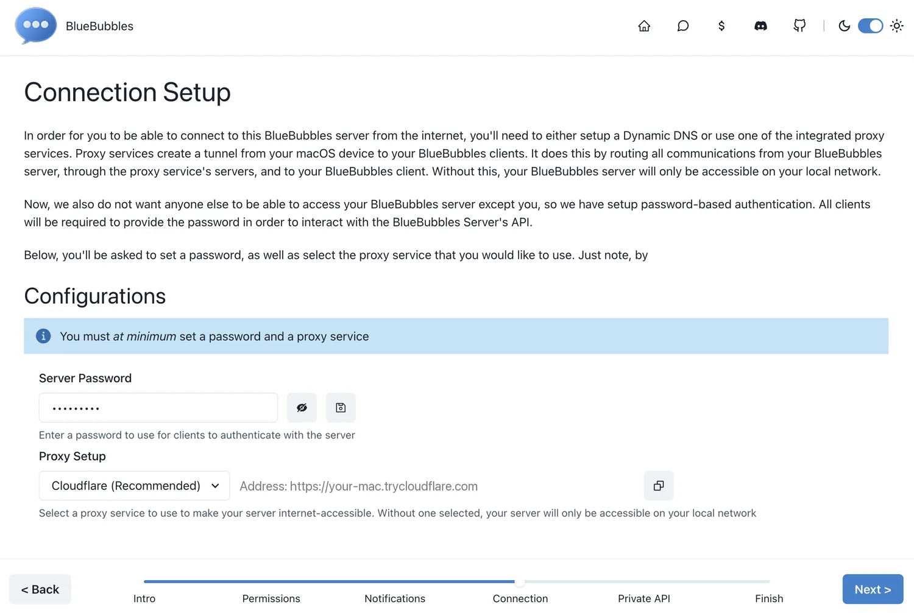
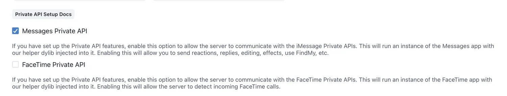
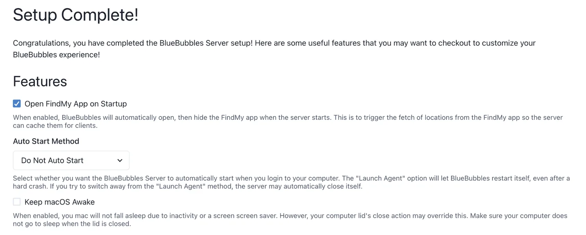
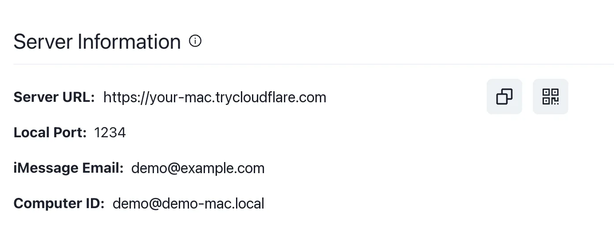
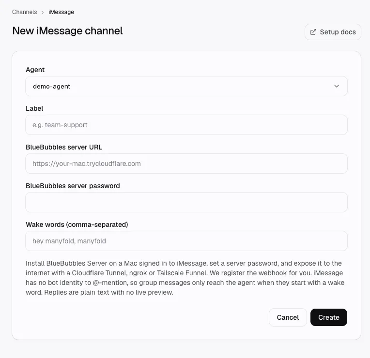

当你希望 Agent 可以通过「信息」App 被找到时，就连接 iMessage，一对一会话和群聊都支持。Apple 没有公开的 iMessage API，因此这个渠道通过 [BlueBubbles Server](https://bluebubbles.app) 工作：它运行在一台已登录 iMessage 的 Mac 上。Manyfold 会在该服务器上注册入站 Webhook，并通过它的 REST API 发送回复。

这是唯一一个需要你自备硬件的渠道。在配置之前请先读 [限制与安全](#限制与安全)：它的信任模型比 Manyfold 的其他所有渠道都弱，而这是 BlueBubbles 能力边界决定的，不是靠配置能解决的。

## 这个渠道支持什么

| 能力 | 支持情况 |
| ---- | -------- |
| 一对一会话 | 支持；每条消息都会触达 Agent。 |
| 群聊 | 支持；默认要求消息以唤醒词开头。 |
| 提及检测 | 仅支持唤醒词。iMessage 没有可 @ 提及的机器人身份。 |
| 斜杠命令 | 支持，作为纯文本输入；「信息」没有命令菜单。 |
| 实时进度 | 不支持；iMessage 无法编辑已发送的消息，因此 Agent 只发送最终回复。 |
| 正在输入提示 | 不支持。 |
| 用表情回应表示状态 | 不支持。 |
| 接收文件和媒体 | 支持；附件会被下载并附加到本轮对话。 |
| Agent 回复中携带文件 | 支持；作为 iMessage 附件发送。 |
| Agent 主动发送 | 支持，目标为已存在的会话，或已有会话记录的号码。 |
| Markdown | 不支持；回复会被压平为纯文本，每个段落一个气泡。 |

## 开始之前

你需要：

- **一台已登录 iMessage 的 Mac**，并保持唤醒和联网。只要这个渠道还在使用，这台 Mac 就必须一直开机并联网，因为会休眠的笔记本会停止投递消息。参见 [限制与安全](#限制与安全)。
- 在这台 Mac 上安装 **BlueBubbles Server**，并设置服务器密码。
- **该服务器的公网地址。** Manyfold 运行在云端，必须能访问到你的 Mac。BlueBubbles 内置的 Cloudflare 代理会在配置过程中给你一个，因此你不需要自己搭隧道。

## 配置 BlueBubbles Server

1. 在这台 Mac 上安装 BlueBubbles Server 并完成初始化，按提示授予「完全磁盘访问权限」。
2. 设置**服务器密码**（一定要记下来，稍后要粘贴到 Manyfold），并在 **Proxy Setup** 里选择 **Cloudflare**。Manyfold 用这个密码进行认证；代理则让这台服务器可以从你自己的网络之外被访问到。

   

3. 在 **Permissions** 里勾选 **Messages Private API**。

   

   这个勾选项只是让服务器去使用该辅助组件；在这台 Mac 上安装组件本身是另一步。它能带来什么、代价是什么，见 [Private API 辅助组件](#private-api-辅助组件)。

4. 在配置的最后一步，把 **Auto Start Method** 设为 **Do Not Auto Start**，并打开 **Keep macOS Awake**。

   

   **Keep macOS Awake** 只能防止 Mac 在闲置时休眠，重启或者合盖之后就不生效了。而选了 **Do Not Auto Start** 之后，Mac 重启后 BlueBubbles 不会自己起来，你得手动再打开一次。这台 Mac 必须持续开机、联网，并且 BlueBubbles 保持运行，否则不会投递任何消息。

5. 服务器跑起来之后，打开 **Server Information** 并复制 **Server URL**。记下来，这就是要填给 Manyfold 的地址。

   

## 连接到 Manyfold

1. 在 Manyfold 中创建一个 provider 为 **iMessage** 的频道。粘贴 BlueBubbles 的**服务器地址**和**服务器密码**，至少设置一个唤醒词（例如 `hey manyfold`），然后点击 **Create**。

   

   Manyfold 会 ping 该服务器、读取版本，并自行注册 Webhook，因此你不需要手动把 URL 粘贴到 BlueBubbles 里。

2. 运行**测试**，每一行都应该是 `✓`。然后从 iMessage 发一条消息，确认 Agent 会回复。

## 唤醒词

iMessage 没有机器人账号，群成员没有可以 @ 的对象。因此群聊消息只有以频道配置的唤醒词开头时才会触达 Agent，并且唤醒词会在 Agent 看到消息之前被去掉：

> **hey manyfold** 这周我们发布了什么？

会变成 `这周我们发布了什么？`。

唤醒词按词边界不区分大小写匹配，所以 `manyfold` 不会匹配 `manyfoldish`。它们始终是字面文本，不接受正则表达式。一对一会话完全忽略唤醒词，每条消息都会触发一轮对话。

## 谁可以使用

把**允许的号码**留空，任何能给这台 Mac 发消息的人都可以驱动 Agent。填写后即为限制名单。号码可以是电话号码或邮箱地址；匹配时忽略格式差异，因此 `+1 (555) 555-0123` 和 `+15555550123` 是同一个人。

**操作员**可以运行 `/model` 等 Agent 级命令。没有配置操作员时，这些命令在 iMessage 中被禁用。

**允许的会话 GUID** 用于限制 Agent 在哪些群聊中回复。会话 GUID 形如 `iMessage;+;chat123456789`。被拦截的会话即使对操作员也依然拦截。

## Private API 辅助组件

BlueBubbles 提供一个可选的 Private API 辅助组件，用于解锁 Apple 未公开的能力。Manyfold 会检测它是否已连接，并在**测试**中报告结果。

这个渠道的绝大部分能力（收发消息、双向附件）**不需要**它。唯一需要它的场景是：向一个从未给这台 Mac 发过消息的号码发起全新会话。没有该组件时，向未知号码主动发送会返回一个明确的错误，而不是静默失败。

安装该组件需要在这台 Mac 上关闭 System Integrity Protection。这是一个关于你自己机器的真实安全决策。配置时勾选 **Messages Private API** 只是在 BlueBubbles 里把这个功能打开。如果你不装该组件，上面这些能力依然可用，只有向全新号码主动发起会话会失败。

## 限制与安全

**Webhook 密钥是一种 bearer 凭据。** BlueBubbles 既不能设置自定义请求头，也不能对负载签名，因此 Manyfold 用一个附加在已注册 Webhook URL 上的、该频道专属的密钥来认证入站消息，并以恒定时间比较。这个 URL 会出现在 BlueBubbles 的 Webhook 列表、你 Mac 的日志，以及隧道服务商的请求日志里。任何能读到它的人都可以向这个 Agent 发消息；而且由于发送者是从消息体中读取的，他们可以伪造成允许名单中的号码。允许名单不是第二重验证。请把已注册的 URL 当作密码对待。

**轮换等于重建频道。** 重新注册会刻意复用现有密钥，以免让 BlueBubbles 已持有的 URL 变成孤儿。要作废泄漏的 URL，请修改服务器密码（这会用新密钥重新注册），或删除并重建该频道。

**请使用 HTTPS。** 服务器密码和 Webhook 密钥都通过查询字符串传输，因为这是 BlueBubbles 唯一接受的认证方式。在明文 `http://` 下它们在传输中可被读取。当服务器地址不是 HTTPS 时，测试会给出警告。

**一台服务器对应一个频道。** BlueBubbles 的 Webhook 是按服务器注册的，而不是按会话。指向同一台 Mac 的两个 Manyfold 频道都会收到每一条消息，并且都会回复。请用「允许的会话 GUID」把它们分开，或者一台 Mac 只跑一个频道。

**Mac 休眠时频道看起来仍然正常。** 入站走的是普通 Webhook，Manyfold 没有可监控的长连接。如果 Mac 休眠或隧道断开，频道状态仍显示 `active`，但什么都不会被投递。回复停止时请运行**测试**，它才是权威检查。在 Mac 上可以用「节能」设置或 `caffeinate -s` 阻止休眠。

**被编辑的消息不会触达 Agent。** iMessage 把编辑作为同一条消息的更新投递，会被 Manyfold 的去重机制丢弃。请改为发送一条新消息。

**电话号码会被存储。** 发送者号码会写入会话名称和投递记录，原始消息负载也会像其他渠道一样保留。如果这对会话中的人很重要，请在连接之前把它考虑进去。
