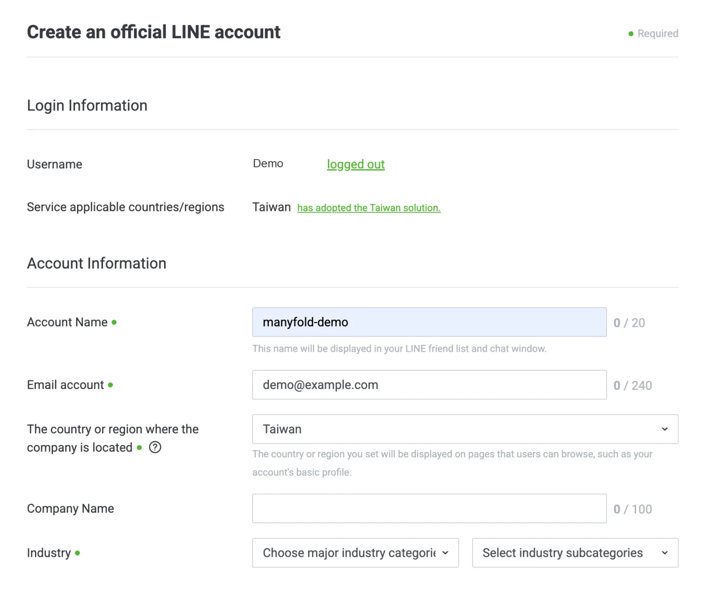
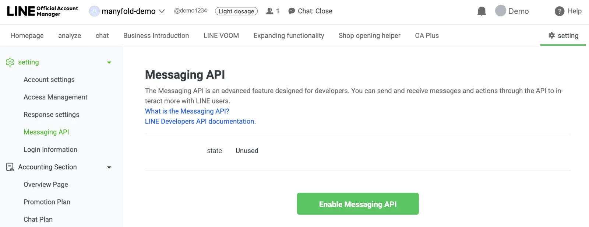
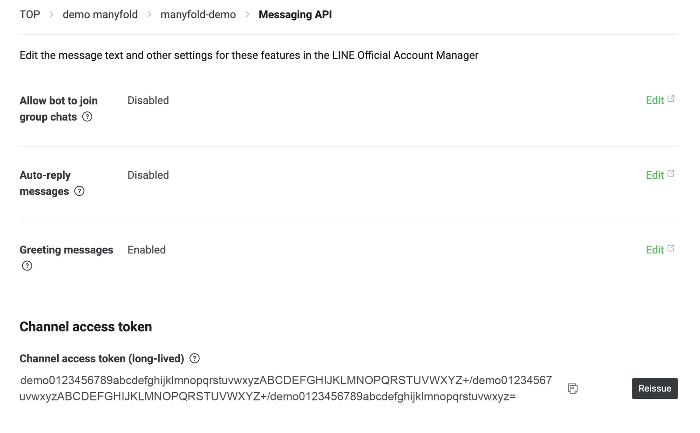
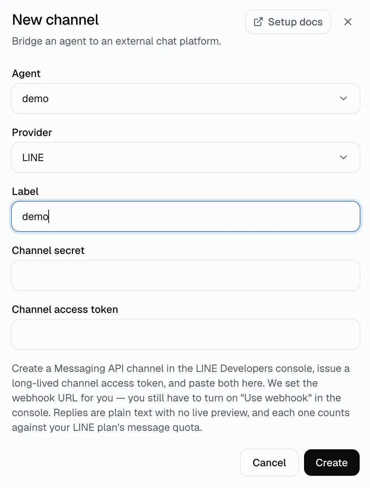
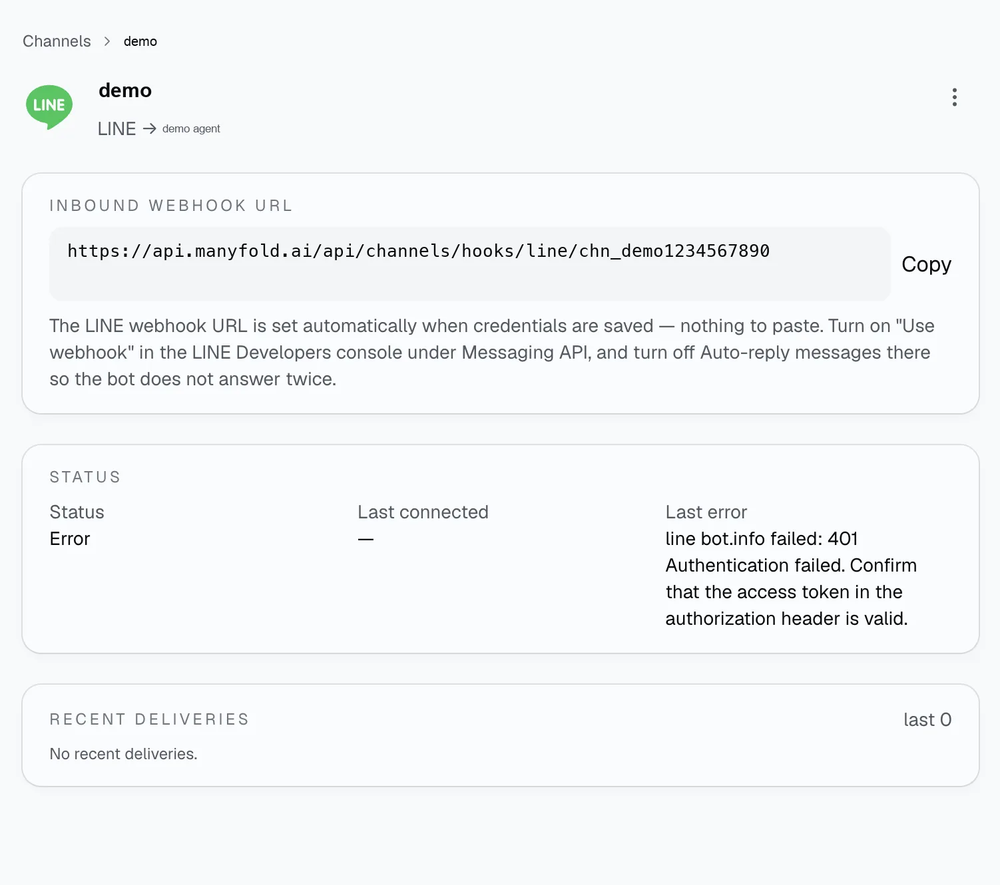
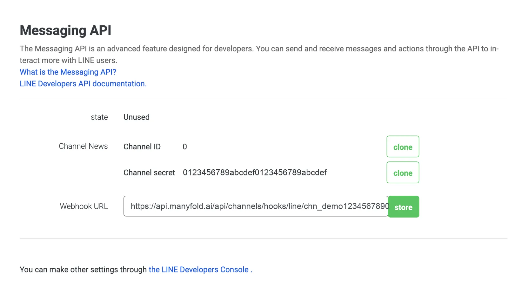
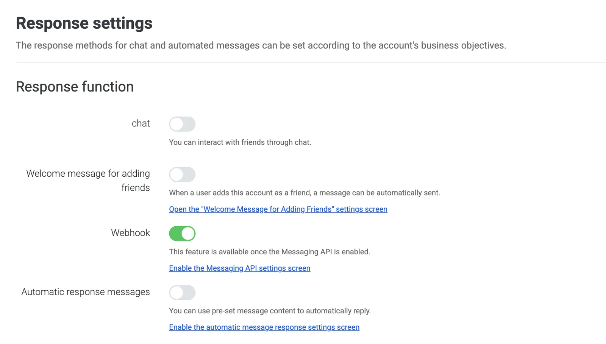

当你希望 Agent 可以通过 LINE 官方账号被找到时，就连接 LINE —— 既支持与用户的一对一聊天，也支持账号被邀请加入的群组和多人房间。配置会在两边进行：先在 LINE Developers 控制台取得凭据，频道注册时 Manyfold 会自动把入站 Webhook URL 写回控制台。

## 该频道支持什么

| 能力 | 支持情况 |
| ---- | -------- |
| 一对一聊天 | 支持；每条文本消息都会转给 Agent。 |
| 群组和多人房间 | 支持；默认需要显式 @ 提及。 |
| 提及检测 | 支持；LINE 原生标记对自己的提及，无需名称匹配。 |
| 斜杠命令 | 以文本形式支持；LINE 没有命令菜单 API，因此菜单里不会显示。 |
| 实时进度 | 不支持；LINE 没有消息编辑 API，Agent 只发送最终回复。 |
| 输入指示 | 仅一对一聊天；LINE 的加载动画无法在群里显示。 |
| 接收文件和媒体 | 支持；图片、视频、音频和文件会被下载并附加到本轮对话。 |
| 普通回复中的文件 | 不支持；LINE 的出站媒体需要公开托管的 URL，因此文件链接会留在文本中。 |
| Agent 显式发送文件 | 不支持；LINE 上不支持 `mf channels send --file`。 |
| 引用回复 | 群里支持；回复会引用触发它的那条消息。 |
| 表情贴图 | 不支持；贴图既没有文本也没有可下载内容，会被跳过。 |

## 前置条件

- 一个已有的 Manyfold Agent。
- 在 [LINE Developers 控制台](https://developers.line.biz/console/) 中拥有 Messaging API 频道的 LINE 官方账号。
- 足够的 LINE 套餐消息额度。Manyfold 使用推送消息回复，**每条回复都会计入你的月度额度** —— 包括长回复被拆分后的每一条。

## 创建 Messaging API 频道

Messaging API 频道已经不能直接在 LINE Developers 控制台创建。请先建立 LINE 官方账号，再从 LINE 官方账号管理后台在它上面启用 Messaging API。

### 建立 LINE 官方账号

1. 前往 [account.line.biz](https://account.line.biz/login)，用个人 LINE 账号、Email 或 QR code 登录。
2. 选择建立账号，填写账号名称、联络 Email 与业态等基本资料。
3. 如果只是先测试，可以选择稍后认证；未认证账号也能继续设置 Messaging API。
4. 建立完成后进入官方账号管理后台，确认左侧目前选到的是刚建立的账号。

### 启用 Messaging API

1. 在 LINE 官方账号管理后台开启 **设置**。
2. 在设置选单找到 **Messaging API**，进入后点击启用。
3. 依画面选择既有 Provider，或建立新的 Provider。Provider 名称可使用公司、项目或品牌名称。
4. 依页面提示同意并完成启用。

### 保存 Channel secret 与 access token

- **Channel ID**：识别这个 Messaging API 频道的数字。
- **Channel secret**：用来验证 LINE Webhook 请求来源的机密值。
- **Channel access token**：让外部系统代表官方账号呼叫 Messaging API 的凭证。

LINE 官方账号管理后台的 **Messaging API** 页面上有 Channel ID 与 Channel secret，稍后 Webhook URL 也填在这一页。Channel secret 从这里复制。

access token 则要在 LINE Developers 控制台签发：

1. 从 Messaging API 设置页面开启 LINE Developers 控制台，或前往 `developers.line.biz`。
2. 选择刚才使用的 Provider，再选择对应的 Messaging API 频道。
3. 开启 **Messaging API** 分页，卷到页面下方的 **Channel access token（长期）**。
4. 点击 **Issue**，把产生的 token 复制到私密的凭证保存位置。如果之前已经签发过，按钮会显示 *Reissue*。这两个值都要当作密码对待。

在同一分页，如果 Agent 需要在群里工作，请打开 **Allow bot to join group chats**。

## 连接到 Manyfold

1. 打开 **设置 -> 频道**。
2. 创建频道并选择 **LINE**。
3. 选择接收消息的 Agent。
4. 填写标签，粘贴 channel secret 和 channel access token。

   

5. 创建频道。Manyfold 会在同一步向 LINE 注册，并把 Webhook URL 设置到 Messaging API 频道上。
6. 打开频道详情页，上面会显示已注册的 **Inbound webhook URL**。

   

7. 回到 LINE 官方账号管理后台，打开 **Messaging API** 页面，检查 **Webhook URL** 栏位。Manyfold 应该已经填好；如果是空的，就把入站 URL 贴上去并保存。

   

注册时 Manyfold 会读取机器人身份（`/v2/bot/info`）、设置 Webhook URL 并激活频道。身份读取排在前面，所以 access token 不对时，注册会在设置 Webhook 之前就中断。如果频道报出 `line bot.info failed: 401`，请更正 access token 后重新注册，或者自己把入站 Webhook URL 粘贴到 **Webhook settings**。

每个入站请求都会用 channel secret 校验 LINE 的 `x-line-signature` 头。轮换凭据会一次性替换两个值，因此需要同时填写 channel secret 和 access token。

## 开启 Webhook 并关闭 LINE 内建回复

这一步放在最后，等 Webhook URL 就位之后再做。有两个设置决定消息能否真正到达 Manyfold，而且都无法通过 API 修改，两者都在 LINE 官方账号管理后台的 **Response settings** 里。

- **Use webhook** 必须打开。Response settings 页面上这一行只写 *Webhook*。Manyfold 会设置 Webhook URL，但无法切换这个开关 —— 频道的 **Test** 操作会在它关闭时报告出来。
- **自动回复消息** 和 **欢迎消息** 应该关闭。如果保持开启，LINE 会先回复，用户会看到两条回复。截图里的英文界面把这两项写作 *Automatic response messages* 和 *Welcome message for adding friends*。

两个设置都完成后，回到 Manyfold 的频道详情页运行 **Test**。

## 会话行为

- 一对一聊天中，每个 LINE 用户拥有独立会话。
- 在群组和房间中，除非启用 **在频道内共享会话**，否则会话按用户隔离。
- LINE 没有话题（thread），因此没有话题隔离设置。
- 打开 **仅提及**（默认）时，群消息必须 @ 提及该账号。检测使用 LINE 自身的 `isSelf` 标记，因此重命名账号不会失效 —— 而 `@all` 广播不算提及。
- 回复是纯文本。发送前会展平 Markdown：代码围栏和行内反引号会被拆掉，`**粗体**`/`*斜体*`/`~~删除线~~` 标记会被移除，`[文本](链接)` 变成 `文本 (链接)`，标题、分隔线和引用标记会被删除。下划线形式（`_斜体_`、`__粗体__`）保持原样，以免 `my_func_name` 这类标识符被破坏。
- 超过 5000 字符的回复会拆成多条消息，每次推送最多携带 5 条。
- 在群里，回复会引用触发它的那条消息；一对一聊天中的回复不加引用。
- 收到的图片、视频、音频和文件会用 channel access token 下载并附加到本轮对话。
- 各处都支持输入斜杠命令；命令清单见 [会话切换](../session-switching/)。
- 发送者显示名会按用户查询，并在进程生命周期内缓存。

## 从 Agent 主动发送

Agent 可以用 `mf channels send` 给 LINE 用户或账号所在的群发消息。LINE 上不支持发送文件，也无法回复某条历史消息 —— 引用需要的 token 只存在于机器人刚收到的消息上。目标 ID、投递结果和限制见 [从 Agent 发送](../agent-send/)。

## 设置

| 设置 | 建议 |
| ---- | ---- |
| 允许的用户 ID | 留空表示任何能联系到该账号的人都可以使用 Agent；否则填写 LINE 用户 ID（`U…`）。 |
| 操作员用户 ID | 留空可禁用 LINE 中的 `/model` 等智能体级命令。列在这里的人可以运行这些命令，并且即使不在允许列表中也会被放行。 |
| 允许的群组 / 房间 ID | 留空表示在账号被邀请的所有群里都回复；否则填写群组（`C…`）或房间（`R…`）ID。 |
| 仅提及 | 群里建议保持开启，一对一聊天不受影响。 |
| 共享会话 | 建议关闭以保留按用户的上下文；只有当群里所有人应共享一个会话时才开启。 |
| 发送消息上下文 | 建议保持开启，这样 Agent 每轮都能拿到发送者和消息 ID。 |
| 进度模式 | 固定为最终回复。LINE 无法编辑已发送的消息，所以做不了实时预览。 |
| `resetOnIdleMins`（API） | 设置分钟阈值，在闲置后开启新会话；留空或设为 `0` 表示关闭。 |

## 验证

在频道详情页运行 **Test**。结果正常时会确认机器人身份、LINE 的 Webhook endpoint 指向该频道，以及 **Use webhook** 已开启。

然后测试你打算使用的路径：

1. 把官方账号加为好友并发一条私聊消息。
2. 发一张图片，确认附件能到达工作区。
3. 群聊场景：把账号邀请进群并发送 `@YourBot hello`。
4. 运行 `/help` 确认命令处理正常。

## 排查

- **Test 在机器人身份检查上失败**：`line bot.info failed: 401` 表示 channel access token 不对或已被撤销。重新签发一个长期 token 并保存，然后再次注册。注册在这一步就会中断，因此 Webhook URL 还没有被设置。
- **Test 提示「Use webhook」已关闭**：在 LINE Developers 控制台的 **Messaging API** 中打开它。Manyfold 无法通过 API 设置。
- **每条消息收到两个回复**：在 LINE 官方账号管理后台关闭 **自动回复消息** 和 **欢迎消息**。
- **完全收不到消息**：重新运行频道的注册操作，然后确认控制台里的 Webhook URL 与该频道的入站 URL 一致。
- **群消息被忽略**：显式提及该账号，或关闭 **仅提及**。同时确认已启用 **Allow bot to join group chats**，并且群 ID 能通过你设置的允许列表。
- **一段时间后不再回复**：检查 LINE 套餐的月度消息额度。推送消息是计量的，拆分后的回复每一条各消耗一次。
- **贴图没有回应**：贴图既没有文本也没有可下载内容，会被跳过。
- **群里没有输入动画**：LINE 的加载动画是一对一功能，无法在群组或房间中显示。
- **某个用户意外能运行 `/model`**：他在操作员列表里。操作员同样会被放行通过发送者允许列表。

## 另请参阅

- [连接频道](../)
- [会话切换](../session-switching/)
- [Telegram](../telegram/)
- [WeChat](../weixin/)
- [从 Agent 发送](../agent-send/)
- [LINE Messaging API 参考](https://developers.line.biz/en/reference/messaging-api/)
- [LINE Developers 控制台](https://developers.line.biz/console/)
