当你希望在 Slack 私聊、公共/私有 channel、多人私聊、thread 或 Slack Assistant 面板中使用 Agent 时，可以连接 Slack。Slack 通过带签名的 webhook 投递事件和原生 slash command。

## 渠道能力

| 能力 | 支持情况 |
| ---- | -------- |
| DM、channel 和 thread | 支持；channel 默认需要 @mention。 |
| Slack Assistant / DM thread | 支持；每个 thread 可使用独立 session。 |
| 原生 slash command | 支持；原生命令回复仅发给调用者（ephemeral）。 |
| 接收文件 | 支持；纯文件消息也可以驱动 Agent。 |
| Agent 生成的文件 | 支持；可把 workspace 文件上传到同一 channel/thread。 |
| 实时进度 | 支持；Agent 工作时更新同一条消息。 |
| 用户和 operator allowlist | 支持；dispatch 前检查 Slack user ID。 |

## 前提条件

- 已有 Manyfold Agent。
- 有权限在 workspace 中创建和安装 Slack app。
- 有权限把 app 邀请到目标 channel。

## 配置 Slack app

Manyfold 可以生成一份 manifest，一次性配好整个 Slack app：Request URL、event subscription、bot scope 以及全部 slash command。但这份 manifest 要等渠道有了 inbound URL 才存在，而渠道又必须先有 bot token 才能创建——所以 app 分两轮建立。先建一个最小的 app，只为了从 Slack 取得凭证；之后再把完整 manifest 贴回同一个 app。

1. 在 [Slack API Apps](https://api.slack.com/apps) 中选择 **Create an App**。

   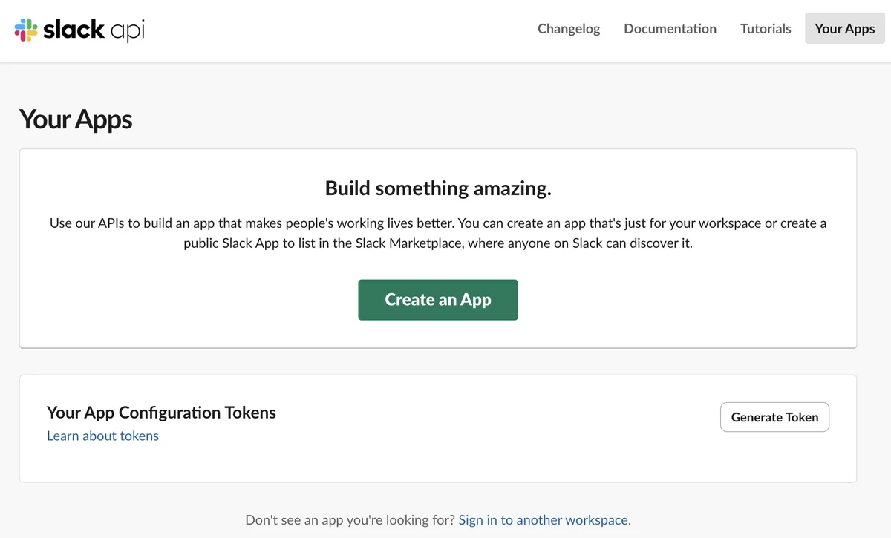

2. 选择 **From a manifest**，选定 workspace 后继续。此时不需要粘贴任何内容，第一轮只需要一个空 app。

   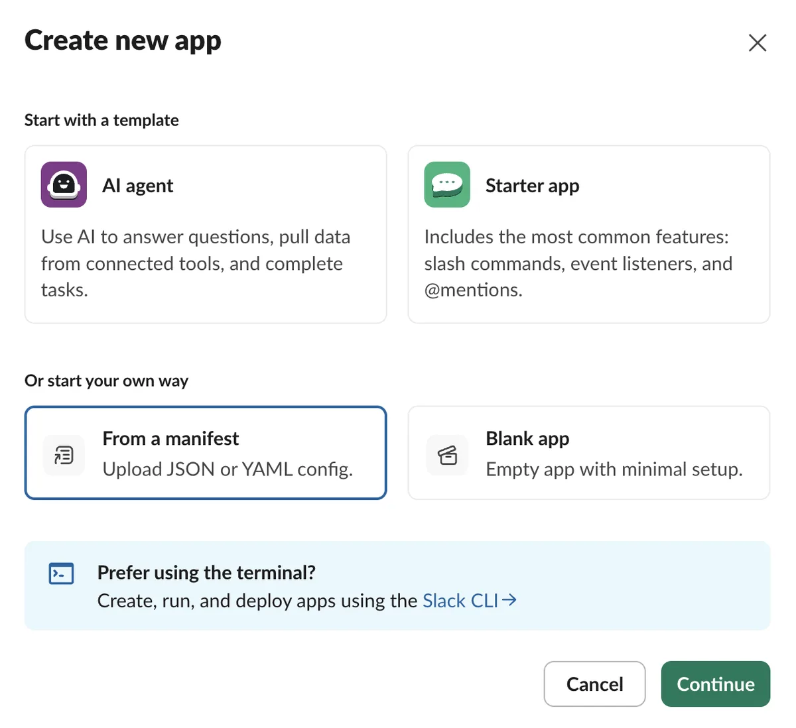

   Slack 创建出的 app 没有任何 scope，因此还不能安装。

   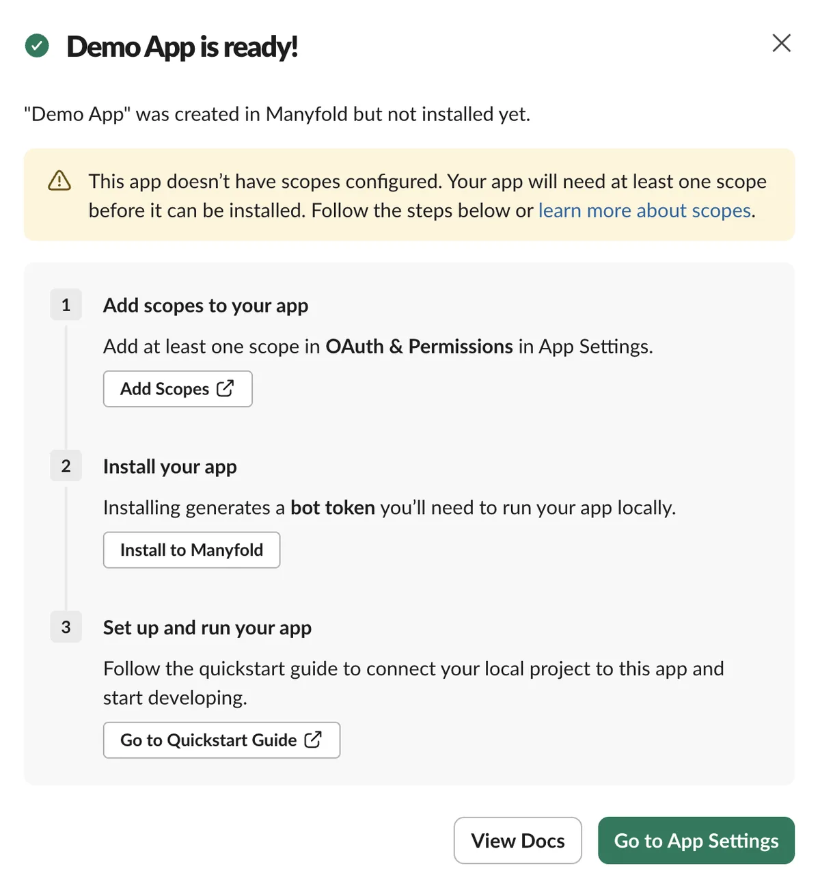

3. 打开 **OAuth & Permissions** 添加 bot token scope。最少需要 `app_mentions:read`、`chat:write`，以及你要支持的每种会话类型对应的 history scope；其余用于开启命令和文件能力。

   | Scope | 用途 |
   | ----- | ---- |
   | `app_mentions:read` | 接收 channel 中的 @mention。 |
   | `channels:history` | 接收公共 channel 消息事件。 |
   | `groups:history` | 接收私有 channel 消息事件。 |
   | `im:history` | 接收私聊消息事件。 |
   | `mpim:history` | 接收多人私聊消息事件。 |
   | `chat:write` | 发送回复和实时进度消息。 |
   | `commands` | 使用原生 slash command。 |
   | `files:read` | 下载用户附加的文件。 |
   | `files:write` | 上传 Agent 生成的 workspace 文件。 |

   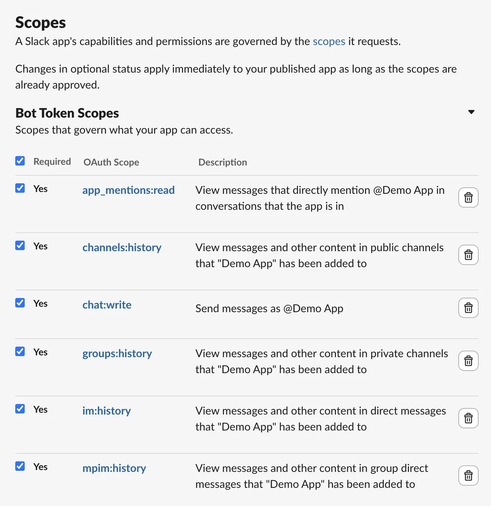

4. 仍在 **OAuth & Permissions** 页面，把 app 安装到 workspace。

   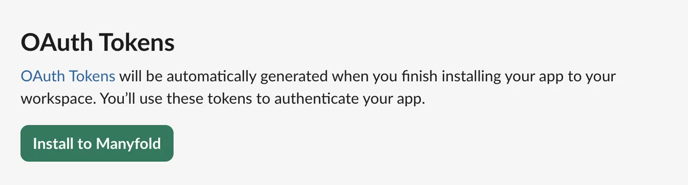

   复制随后出现的 **Bot User OAuth Token**。它以 `xoxb-` 开头，本身就是凭证：任何拿到它的人都能以该 bot 身份发言，所以不要出现在共享文档或截图里。

   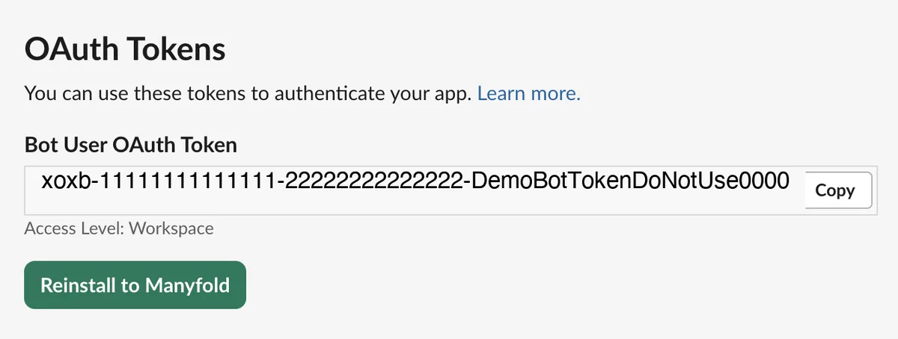

5. 打开 **Basic Information**，在 **App Credentials** 中找到 **Signing Secret**，点 **Show** 复制。Slack 用这个 secret 对发出的每个请求签名，Manyfold 会拒绝任何无法验证的请求。

   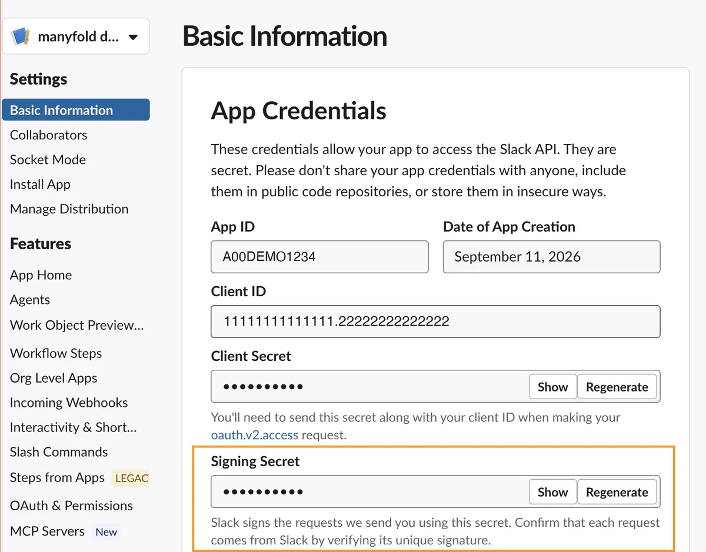

## 连接到 Manyfold

1. 打开 **Settings -> Channels**，创建渠道并选择 **Slack**。

   | 字段 | 填什么 | 从哪里拿 |
   | ---- | ------ | -------- |
   | Agent | 负责回复的 Agent | 从 Agent 页进入时已自动填好 |
   | Label | 能标识这个渠道的名称 | 自己取 |
   | Bot token | `xoxb-` 开头那串 | Slack 的 **OAuth & Permissions** |
   | Signing secret | signing secret | Slack 的 **Basic Information -> App Credentials** |
   | Allowed user IDs | 选填。留空表示 workspace 内任何人都能用 | — |
   | Operator user IDs | 选填。可运行 `/model` 等 Agent 级命令的人；留空则禁用这些命令 | — |

   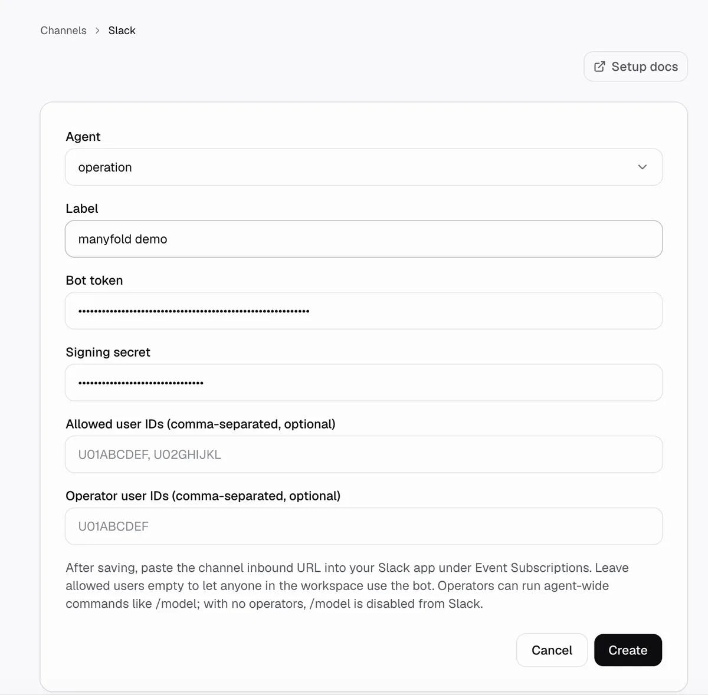

2. 创建渠道，然后运行 **Register**。注册会调用 `auth.test` 并保存 bot user ID 和 workspace ID。

3. 在渠道页面选择 **Copy manifest JSON**。同一页面也会显示该渠道的 inbound webhook URL，manifest 里已经指向它。

   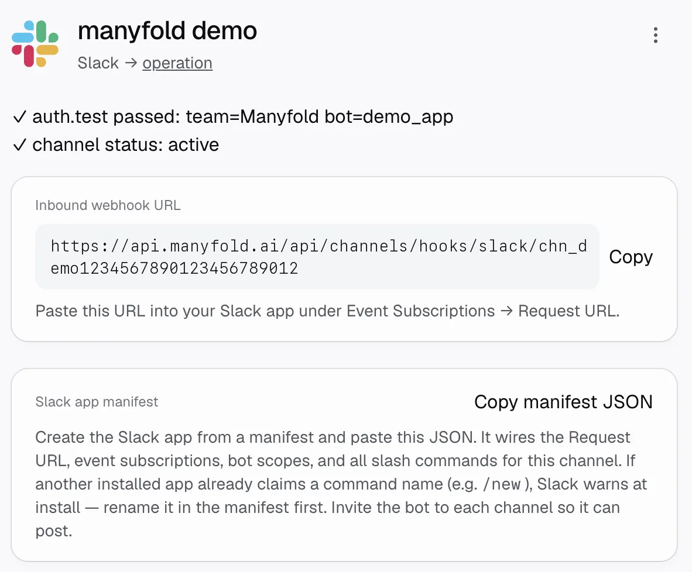

4. 回到 Slack app，在左侧菜单打开 **App Manifest**。全选现有 JSON 并删除，粘贴刚复制的 manifest，然后保存。Slack 会在保存时校验：如果某个 slash command 名称（例如 `/new`）已被其他已安装的 app 占用，先在 manifest 里改名再保存。

   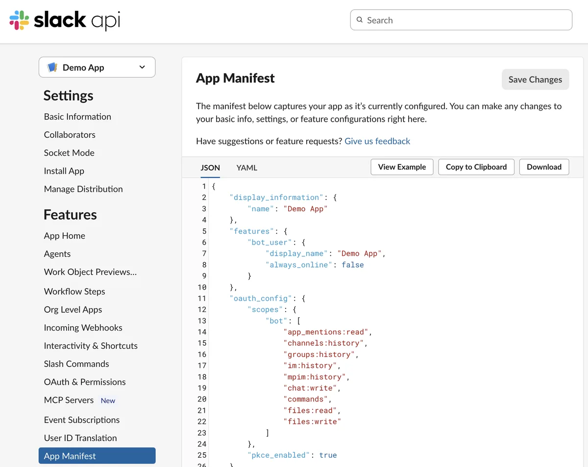

   manifest 会为 bot 订阅以下事件：

   | Bot event | 用途 |
   | --------- | ---- |
   | `app_mention` | 接收 channel 中明确的 @mention。 |
   | `message.channels` | 公共 channel 消息，包括 file share。 |
   | `message.groups` | 私有 channel 消息。 |
   | `message.im` | 私聊和 Assistant 对话。 |
   | `message.mpim` | 多人私聊。 |

5. 回到 **OAuth & Permissions** 重新安装 app。修改 scope 和 slash command 后必须重装才会生效。token 不会变化，因此 Manyfold 这边不需要改动。

6. 在渠道上运行 **Test**。

来自非注册 workspace 的消息会被拒绝；把 app 移动或重新安装到其他 workspace 后，请再次注册。

## 消息和文件

- 文本、Slack file share 和纯文件消息都可以驱动 Agent。
- Incoming file 使用 Slack 鉴权下载 URL。Manyfold 每条消息最多接收 10 个文件、单文件 25 MB、总计 100 MB；不支持或超限文件会被跳过，其他文本/文件仍继续处理。
- 开启 **Attach files the agent links** 后，final answer 中链接的 workspace 文件会上传到同一 channel 或 thread。
- 长回复会拆成多段，后续段落会留在当前 Slack thread。
- Markdown 链接和基本强调会转换为 Slack 原生格式。

文件输入仍要求所选 Agent framework 支持 attachment。

## Thread 和命令

- 开启 **Thread isolation** 后，每个 channel thread、Assistant 对话或手动 DM thread 映射到独立 session；普通 DM 按用户保持一个扁平 session。
- **Auto-thread** 会把顶层 channel mention 回复到以该消息为根的新 thread。它要求 thread isolation，且不适用于 DM 或 slash command。
- 原生 slash command 使用 Slack command payload，并返回仅调用者可见的 ephemeral 回复。Slack 原生命令 payload 不包含输入框所在 thread，因此它操作 channel-level scope，而不是当前打开的 thread。
- 文本形式的命令仍走普通消息路径。完整命令见[切换 Session](/zh/docs/channels/session-switching/)。

## 设置

| 设置 | 建议 |
| ---- | ---- |
| Mention only | Channel 中建议开启；DM 无需 mention。 |
| Shared session | 默认关闭以按用户隔离；只有明确希望团队共享一段对话时才开启。 |
| Thread isolation | 保持开启，让每个 Slack thread 使用独立 session。 |
| Auto-thread | 希望顶层 mention 自动进入 thread 时开启。 |
| Progress mode | **Preview** 更新一条实时消息；**Activity** 还会显示工具/思考活动；**Final** 只发送最终答案。 |
| Attach files the agent links | 希望用户在 Slack 收到生成文件时保持开启。 |
| Send message context | 建议开启，让 Agent 获得 sender、workspace/channel、thread 和 message ID。 |

## 访问控制

| 设置 | 效果 |
| ---- | ---- |
| Allowed user IDs | 非空时只有列出的 Slack 用户和 operator 能使用 bot；留空允许 app 在已注册 workspace 中能触达的所有人。 |
| Operator user IDs | 允许执行 `/model` 等 Agent 级命令的用户；留空会禁用这些 Slack 命令。 |

在成员 profile 的三点菜单中选择 **Copy member ID** 获取 Slack user ID。Operator 自动拥有对话权限。Slack 身份只是外部 actor，不会关联到 Manyfold 账号。

## 验证

运行 **Test**，通过 `auth.test` 验证 token 并确认渠道 active。然后：

1. 私聊 app。
2. 把 app 邀请到 channel 后 @mention。打开该 channel，选择 **Add people**，再按名称选中这个 app。

   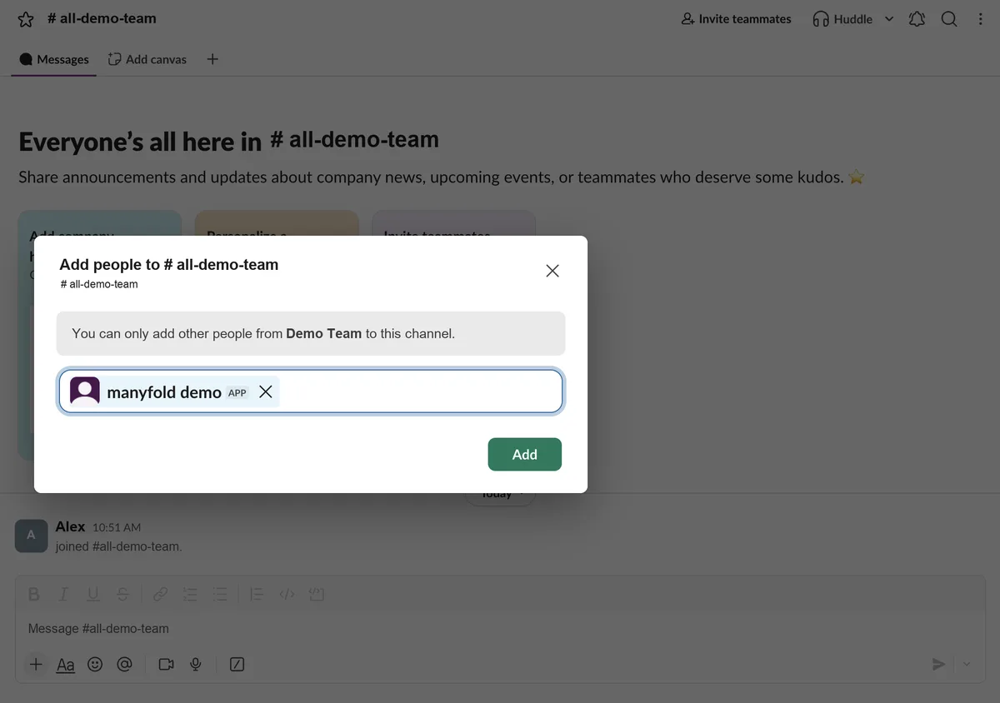

3. 从 Slack command 菜单运行 `/help`。
4. 如需文件能力，上传一个小文件测试。

## 排查问题

- **Request URL 验证失败**：确认 signing secret，并使用 Manyfold 当前显示的 inbound URL。
- **Bot 忽略 DM 或某类 channel**：添加对应 `message.*` event 和 history scope，然后重新安装 app。
- **Bot 收到 channel 消息但无法回复**：邀请 app 进入 channel，并确认 `chat:write`。
- **Slash command 不存在或被其他 app 响应**：添加 `commands`、使用当前渠道 URL 创建 command，并解决 workspace 内名称冲突。
- **Scope 或 event 修改不生效**：重新安装 Slack app。
- **文件输入失败**：确认 `files:read`；输出失败时确认 `files:write` 和 **Attach files the agent links**。
- **用户消息被静默忽略**：检查 Allowed user IDs，并确认 app 仍安装在渠道记录的 workspace。
- **回复进入错误 scope**：检查 **Thread isolation**、**Auto-thread** 和 **Share session in channel**。

## 另请参阅

- [连接渠道](/zh/docs/channels/)
- [切换 Session](/zh/docs/channels/session-switching/)
- [Telegram](/zh/docs/channels/telegram/)
- [Lark 和飞书](/zh/docs/channels/lark/)
- [Discord](/zh/docs/channels/discord/)
- [Matrix](/zh/docs/channels/matrix/)
- [Slack app manifests](https://api.slack.com/reference/manifests)
- [Slack Events API](https://api.slack.com/apis/events-api)
