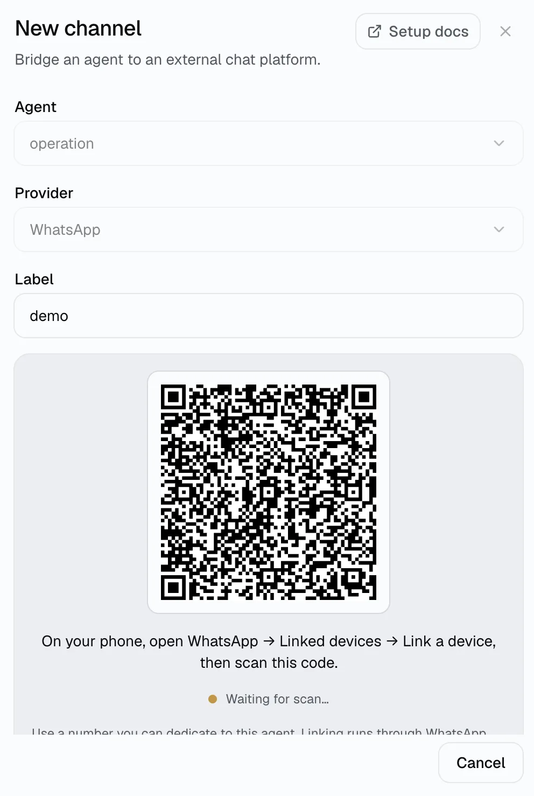
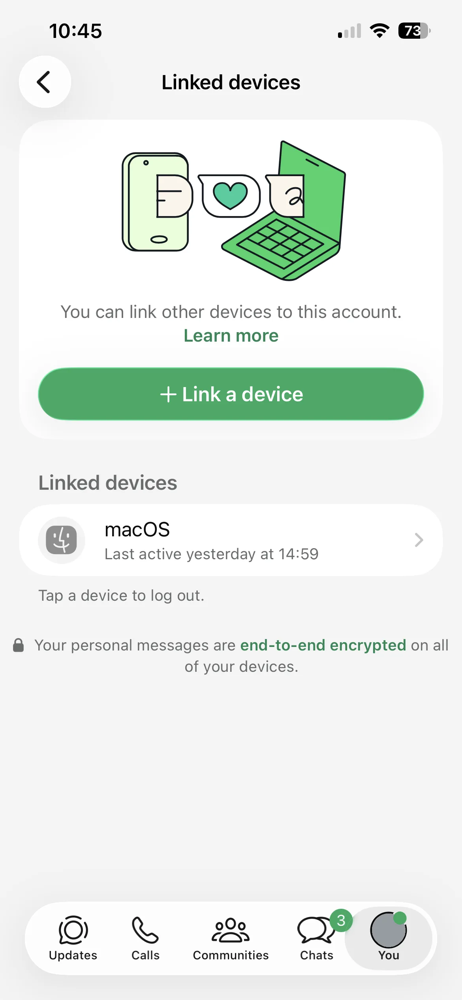

当你希望 Agent 在 WhatsApp 私聊和群聊里回复时，可以连接 WhatsApp。Manyfold 的接入方式与 WhatsApp Web 相同：你用手机扫码，Manyfold 在服务端维持这个「已关联设备」会话。不需要公开 webhook，也不需要 Meta Business 账号。

:::caution
关联走的是 WhatsApp Web，Meta 并未正式支持自动化用途。请使用可以专门分配给该 Agent 的号码（独立 SIM 或 eSIM），不要用你的个人号码。Meta 可能封禁被判定为自动化的号码，且封禁作用于号码本身，而不只是这个 Channel。
:::

## 支持的能力

| 能力 | 支持情况 |
| ---- | -------- |
| 私聊 | 支持；发给该号码的每条消息都会触发 Agent。 |
| 群聊 | 支持；默认只在被 @提及、或有人回复 Agent 消息时才响应。 |
| 实时进度 | 不支持；已关联设备无法可靠地编辑已送达的消息，因此 Agent 在整轮结束后一次性回复。执行期间会显示「正在输入」。 |
| 斜杠命令 | 支持手动输入的命令；WhatsApp 没有由 Manyfold 托管的原生命令菜单。 |
| 文件与媒体 | 可接收图片和白名单内的文档类型；可发送 Agent 引用的图片和文件。语音和视频以占位符形式呈现。 |
| 回复 | 支持；回复 Agent 的消息视为对它说话，被引用的消息 id 也会传给 Agent。 |
| 表情回应 | 支持；触发消息在处理期间标记 👀，结束后变为 ✅ 或 ❌。 |
| Agent 主动发送 | 支持；可指定手机号或群 jid。 |

## 前置条件

- 一个已有的 Manyfold Agent。
- 一台装有 WhatsApp 的手机，并已登录你希望 Agent 使用的号码。

## 连接到 Manyfold

1. 打开 **Settings -> Channels**。
2. 新建 Channel，选择 **WhatsApp**。
3. 选择 Agent 并填写标签。
4. 点击 **生成二维码**。

   

5. 在手机上打开 WhatsApp，进入 **已登录的设备 -> 关联设备**，扫描二维码。

   

手机确认关联后，Manyfold 会立即创建并激活该 Channel；不需要复制任何 token，也不需要注册 inbound URL。等待期间二维码每隔几秒会刷新一次，整次尝试在 8 分钟后过期——超时后重新生成即可。

一个 WhatsApp 号码只能绑定一个 Channel。关联一个已被占用的号码会明确报错，而不会静默地把绑定迁走。

## 访问控制

- **允许的用户**是发送者白名单，可以写手机号（`+15551234567`）或原始 jid。留空表示任何人发消息都会被处理。
- **Operator 用户**控制 `/model` 这类 Agent 级命令。operator 列表为空时，这些命令对所有人禁用（fail-closed）。
- **允许的群聊**按群 jid（`…@g.us`）限制 Channel 响应的群。留空表示该号码所在的所有群。
- 发送者第一次给该号码发消息后，其 jid 会出现在 Channel 的投递日志里，可从那里复制来配置白名单。

自 WhatsApp 改用按会话的标识后，同一个人可能以手机号形式出现，也可能以不透明的 `…@lid` 身份出现。白名单里的手机号匹配手机号形式；`…@lid` 条目只精确匹配该身份本身。

## 消息行为

- 群聊中 **Mention only** 默认开启：Agent 只在被 @提及、或有人回复它的消息时响应。关闭后会响应所有群消息。
- **Share session in channel** 决定一个群是共用一个会话，还是每个发送者各有一个。默认关闭，因此每位参与者拥有各自的上下文。
- 长回复会按约 4000 字符切分，按顺序发送，中间有短暂停顿。若前面的分段已送达而后续分段失败，Channel 会追加一条截断提示，而不是重发用户已经读到的内容。
- 入站图片和白名单内的文档类型会被下载、解密并作为附件传给 Agent。语音和视频以占位符形式呈现，因为这些格式不在附件策略内。
- 当 Agent 在回复中引用工作区文件时，图片按图片发送，其他文件按文档发送。
- 你自己发出的消息、状态更新、Newsletter 和群发消息都不会触发 Agent。

## Agent 主动发送

绑定到已激活 WhatsApp Channel 的 Agent 可以用 `mf channels send` 主动发起消息。拥有该 Channel 且具备 `channels:edit` 权限的人类 token 也可以使用同一命令。

```sh
mf channels send <channelId> --user-id '+15551234567' --text 'Your build finished.'
```

用 `--chat-id` 加群 jid 可以发到群里。WhatsApp 的主动发送不支持指定回复目标。

## 设置建议

| 设置 | 建议 |
| ---- | ---- |
| 允许的用户 | 私有部署建议配置白名单。留空表示任何人发消息都可以用。 |
| Operator 用户 | 填入允许执行 Agent 级命令的发送者。留空表示对所有人禁用这些命令。 |
| 允许的群聊 | 把 Channel 限制在指定群。留空表示该号码所在的所有群。 |
| Mention only | 群消息多时建议保持开启，只在被明确呼叫时响应。 |
| Share session in channel | 希望整个群共用一个会话时开启。 |
| 附带 Agent 引用的文件 | 建议保持开启，以上传最终回复中引用的文件；纯文本输出可关闭。 |
| 发送消息上下文 | 建议保持开启，让 Agent 拿到发送者和消息 ID。 |

## 验证

运行 **Test**。健康的结果会报告已关联的号码，并确认 Channel 处于 active、连接在线。随后用另一台手机给该号码发消息，确认 Agent 会回复。

## 排查

- **Channel 报「logged out」**：关联设备已从手机端被移除（你在**已登录的设备**里手动移除，或被 WhatsApp 移除）。已存储的会话无法恢复——删除该 Channel，重新扫码连接一个新的。
- **还没扫码二维码就过期了**：重新生成。每次尝试允许若干次二维码刷新，8 分钟后整体失效。
- **关联时报「已连接」**：该号码已经绑定了另一个 Channel。先删除原 Channel，或换一个号码。
- **Agent 不响应群消息**：确认该群在**允许的群聊**里（或留空），并且要么 @提及 Agent，要么关闭 **Mention only**。
- **Agent 不响应某个发送者**：确认该发送者在**允许的用户**里（或留空）。如果对方以 `…@lid` 身份出现，需要原样填入该身份。
- **Agent 级命令被拒绝**：把该发送者加入 **Operator 用户**。
- **Channel 反复重连**：WhatsApp 会例行断开关联设备，Manyfold 会按退避策略重连。持续失败通常意味着手机长时间离线——在手机上打开 WhatsApp 即可。

## 另请参阅

- [连接 Channel](../)
- [会话切换](../session-switching/)
- [Telegram](../telegram/)
- [WeChat](../weixin/)
- [从 Agent 发送](../agent-send/)
